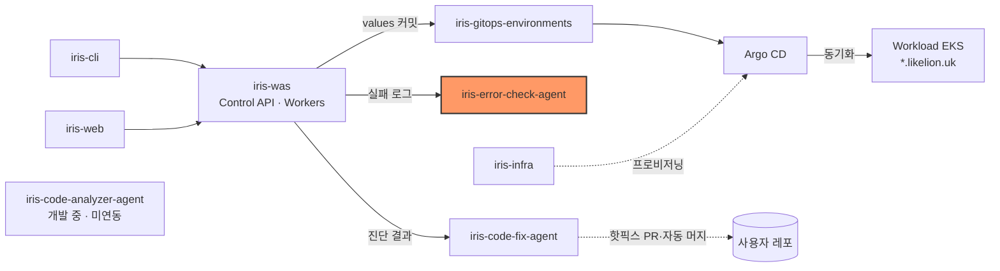
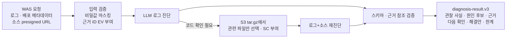

# iris-error-check-agent

Likelion 배포 실패 로그와 소스 스냅샷으로 원인·근거·해결안을 진단하는 에이전트다.


## 시스템 내 위치



- 호출자: [iris-was](https://github.com/2026-softbank-1/iris-was) Control API가 배포 실패(`FAILED`·`ROLLED_BACK`·`MANUAL_INTERVENTION`) 확정 시 자동으로 `POST /diagnose`를 호출하고 결과를 DB에 저장한다([ADR 0020](https://github.com/2026-softbank-1/iris-was/blob/main/docs/adr/0020-ai-error-diagnosis-via-agent-server.md)).
- 진단 결과는 WAS를 거쳐 [iris-code-fix-agent](https://github.com/2026-softbank-1/iris-code-fix-agent)의 수정 후보 입력이 된다.

## 동작 흐름



- 상태는 `diagnosed`·`insufficient_evidence`·`no_failure_evidence` 세 가지다. 근거가 부족하면 원인을 단정하지 않는다.
- 모든 주장은 서버가 부여한 로그(`EV`)·소스(`SC`) 근거 ID에 연결돼야 하며, 참조가 깨진 응답은 거절한다.
- 해결안은 적용 조건·수정 예시·검증·롤백을 담은 제안이다. 실행하지 않는다(`remediation_execution=not_executed`).
- 소스를 못 읽어도 로그 진단은 유지한다.

### 진단 모드

| 모드 | 설정 | 동작 | 상세 |
| --- | --- | --- | --- |
| standard | `AGENT_DIAGNOSIS_MODE=standard` (기본) | 로그 진단 후 필요하면 소스 재진단, LLM 최대 2회 | [DIAGNOSIS_LATENCY](docs/DIAGNOSIS_LATENCY.md) |
| adaptive | `AGENT_DIAGNOSIS_MODE=adaptive` | 명확한 Node `ENOENT`면 소스를 먼저 읽어 1회 진단, 아니면 standard | [DIAGNOSIS_LATENCY](docs/DIAGNOSIS_LATENCY.md) |
| graph_compact | `AGENT_DIAGNOSIS_MODE=graph_compact` (운영) | 지원 오류는 SHACL/SPARQL 후보를 LLM이 짧게 채택·보류, 해결안은 서버 템플릿 조립. 미지원은 adaptive | [GRAPH_COMPACT](docs/GRAPH_COMPACT.md) |
| 지식 그래프 shadow | `AGENT_KG_MODE=shadow` (기본 off) | 확정된 결과를 RDF로 옮겨 SHACL 검증·내부 저장. 응답·판단에 영향 없음 | [KNOWLEDGE_GRAPH_SHADOW](docs/KNOWLEDGE_GRAPH_SHADOW.md) |

평가(합성 사례, 개발용): 20건 상태 정확도 100%·원인 식별 11/12([합성 평가](docs/SYNTHETIC_DIAGNOSIS_EVALUATION_2026-10-03.md)), graph_compact 지원 사례 4건 응답 중앙값 20.5초→3.0초([GRAPH_COMPACT](docs/GRAPH_COMPACT.md)). 실제 운영 장애 정확도는 측정하지 않았다.

## 기술 스택

- Python 3.11+ (이미지는 3.12), FastAPI·Uvicorn, Pydantic v2, httpx, jsonschema, rdflib·pySHACL(그래프 모드)
- LLM: OpenAI Responses API 직접 호출 또는 OpenCode 1.18.34 경유. Sakana 모델 선택 가능

## 디렉터리 구조

```text
src/ai_error_check_agent/  진단 코어 · API(api.py) · CLI · 그래프(knowledge/)
config/ examples/          OpenCode 전용 설정 · 합성 요청·참조 답변
evaluation/ tests/         평가 데이터셋·벤치마크 · pytest
docs/                      설계·평가·운영 문서
*.cmd                      Windows 실행 스크립트
```

## 빠른 시작

macOS·Linux 기준. Python 3.11 이상이 필요하다.

```sh
python3 -m venv .venv
.venv/bin/pip install -r requirements-dev.lock
.venv/bin/pip install --no-build-isolation --no-deps -e .
cp .env.example .env            # LLM_API_KEY 입력
.venv/bin/python -m ai_error_check_agent.api --dev   # 127.0.0.1:8001, API 키 없이 루프백 전용
```

다른 터미널에서 합성 요청을 보낸다. 실제 LLM 사용량이 발생한다. Swagger는 `http://127.0.0.1:8001/docs`다.

```sh
curl -X POST http://127.0.0.1:8001/diagnose -H 'Content-Type: application/json' \
  --data-binary @examples/backend-log-only.request.json
```

Docker(서버 모드, `.env`에 `AGENT_API_KEY` 32자 이상 필요):

```sh
docker build -t iris-error-check-agent:0.5.0 .
docker run --rm --env-file .env -e AGENT_RUNTIME=opencode -p 127.0.0.1:8001:8001 --stop-timeout 280 iris-error-check-agent:0.5.0
```

- 필수 환경변수: `LLM_API_KEY`, `LLM_MODEL`, 서버 모드면 `AGENT_API_KEY`. 나머지는 [.env.example](.env.example).
- 모델 없이 확인: `.venv/bin/python -m pytest -q`
- Windows CMD(`run_api.cmd`, `run_diagnosis.cmd`, `run_opencode.cmd`)와 OpenCode·Fast 모드·오류 코드 설명은 [로컬 실행 상세](docs/LOCAL_RUN.md), Docker 상세는 [DOCKER](docs/DOCKER.md).

## 인터페이스

| 엔드포인트 | 용도 |
| --- | --- |
| `POST /diagnose[?model=]` | 진단. `X-API-Key` 인증, 본문은 `success/message/data` 전체 또는 `data`만. 동기 응답 |
| `GET /models` | 선택 가능한 모델 목록 |
| `GET /healthz` | 생존 확인(모델 호출 없음) |

응답 예시(`diagnosis-result.v3`, [examples/configuration.analysis.json](examples/configuration.analysis.json) 기반 축약):

```json
{
  "schema_version": "diagnosis-result.v3",
  "diagnosis_id": "diag-…",
  "job_status": "succeeded",
  "analysis": {
    "analysis_status": "diagnosed",
    "summary": "앱이 DATABASE_URL을 읽지 못해 시작에 실패했습니다.",
    "hypotheses": [{ "id": "H1", "category": "configuration", "support_level": "direct",
      "statement": "앱 시작 시점에 필수 설정 DATABASE_URL을 확보하지 못했습니다.", "evidence_ids": ["EV000001"],
      "uncertainty": "설정 미등록, 전달 실패, 앱의 설정 로딩 문제는 현재 로그만으로 구분할 수 없습니다." }],
    "next_checks": [{ "id": "C1", "target": "실행 환경의 DATABASE_URL 설정" }],
    "remediation": { "status": "proposed", "plans": [{ "id": "R1", "title": "실행 환경에 DATABASE_URL 등록 및 전달",
      "changes": [{ "kind": "configuration", "snippet_kind": "template", "snippet": "DATABASE_URL={{DATABASE_URL}}" }] }] },
    "limitations": ["입력은 앱 시작 로그이며 실제 배포 설정은 확인하지 않았습니다."]
  },
  "remediation_execution": "not_executed",
  "evidence": [{ "id": "EV000001", "stage": "runtime", "stream": "stderr", "text": "ERROR Missing required configuration: DATABASE_URL" }],
  "source_analysis": { "status": "not_needed" },
  "error": null
}
```

- 요청 계약·S3 소스 규칙·오류 코드: [BACKEND_JSON_V04](docs/BACKEND_JSON_V04.md)
- 전체 결과 필드와 해결안 구조: [RESULT_SCHEMA](docs/RESULT_SCHEMA.md)
- 모델 선택: [MODEL_SELECTION](docs/MODEL_SELECTION.md)

## 배포

- 흐름: GitHub Actions(수동) → ECR `iris/error-check-agent` → iris-gitops-environments `platform/aws-dev-management/error-check-agent.yaml`에 digest 커밋 → Argo CD → management EKS iris-platform chart의 `errorAgent`.
- [deploy-platform.yml](.github/workflows/deploy-platform.yml)은 `workflow_dispatch` 전용이다. main 머지만으로는 배포되지 않는다.
- 실행 설정(활성화·Secret·모델·환경변수)은 [iris-infra](https://github.com/2026-softbank-1/iris-infra) `clusters/aws-dev-management/values/platform.yaml`의 `errorAgent`가 정한다. 현재 `gpt-6.1-sol`, `AGENT_DIAGNOSIS_MODE=graph_compact`, `OPENAI_SERVICE_TIER=fast`이며 런타임은 이미지 기본값(OpenCode)이다.
- 키(`LLM_API_KEY`, `AGENT_API_KEY`)는 Secret `iris-error-agent`에서 주입한다. WAS는 클러스터 내부 `iris-platform-error-agent.iris-platform.svc.cluster.local:8001`로 호출한다.

## 현재 상태 / 한계

- 구현: `POST /diagnose`(v3)·`GET /models`·CLI, direct/OpenCode 런타임, S3 소스 조건부 분석, 세 진단 모드와 KG shadow.
- 운영: management EKS 배포와 WAS 자동 호출까지 연결됐다. 진단 이력·비동기 처리·권한 확인은 WAS가 맡는다.
- graph_compact 빠른 경로는 Node `ENOENT` 파일 읽기 한 유형만 지원하고, 나머지는 기존 경로로 처리해 10초 안을 보장하지 않는다.
- 마스킹한 로그 입력이 예산(16 KiB)을 넘으면 거절한다. 긴 로그 발췌는 미구현이다. 동시 처리는 2건이며 초과 시 `429 BUSY`.
- 마스킹은 알려진 패턴만 대상으로 한다. 평가는 합성 사례 기준이다.
- 상세 제한·코드 위치: [IMPLEMENTATION_NOTES](docs/IMPLEMENTATION_NOTES.md)

## 문서

- 개발·평가: [DIAGNOSIS_LATENCY](docs/DIAGNOSIS_LATENCY.md), [GRAPH_COMPACT](docs/GRAPH_COMPACT.md), [KNOWLEDGE_GRAPH_SHADOW](docs/KNOWLEDGE_GRAPH_SHADOW.md), [RELATION_REASONING](docs/RELATION_REASONING.md)(관계 추론 `AGENT_REASONING_MODE=assist`), [REMEDIATION_V2](docs/REMEDIATION_V2.md), [EVALUATION](docs/EVALUATION.md)
- 연동·실행: [BACKEND_JSON_V04](docs/BACKEND_JSON_V04.md), [API_SOURCE_ANALYSIS](docs/API_SOURCE_ANALYSIS.md), [OPENCODE_INTEGRATION](docs/OPENCODE_INTEGRATION.md), [DOCKER](docs/DOCKER.md), [LOCAL_RUN](docs/LOCAL_RUN.md)
- 테스트 보고서: `docs/*_TEST_REPORT_*.md`, [SYNTHETIC_DIAGNOSIS_EVALUATION](docs/SYNTHETIC_DIAGNOSIS_EVALUATION_2026-10-03.md)
