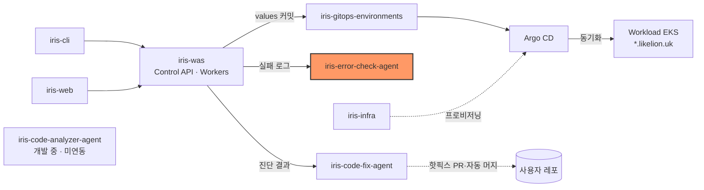
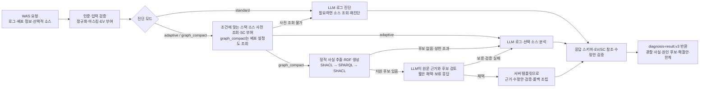
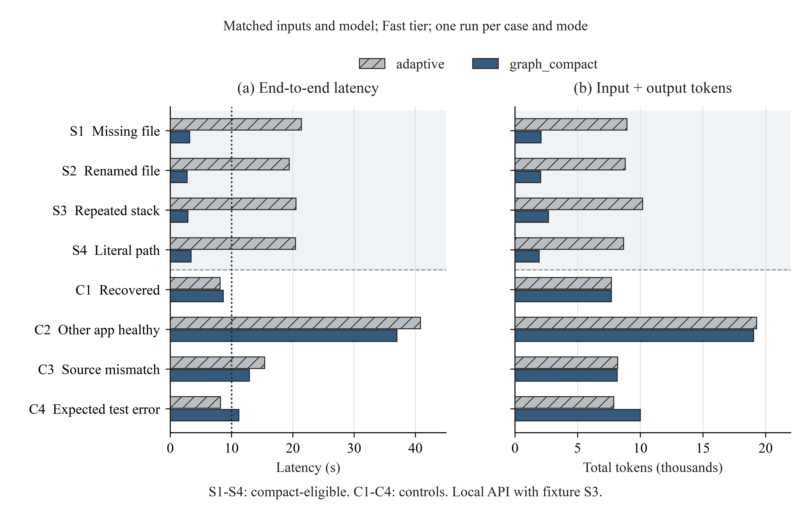
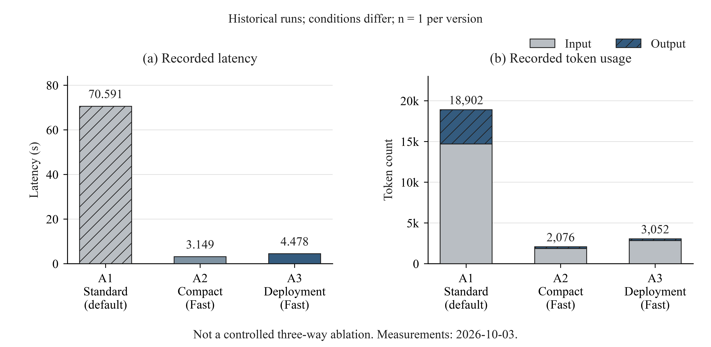

# iris-error-check-agent

IRIS/Likelion의 배포 로그와 소스 스냅샷·배포 설정을 대조해 관찰 사실, 원인 후보, 근거와 조건부 해결안을 반환하는 에이전트다. `graph_compact`에서는 코드가 만든 근거 그래프를 LLM이 검토하고 서버가 상세 해결안을 조립한다.


## 시스템 내 위치



- 호출자: [iris-was](https://github.com/2026-softbank-1/iris-was) Control API가 진단 대상인 실패 배포(`FAILED`·`ROLLED_BACK`·`MANUAL_INTERVENTION`)를 탐색해 자동 진단을 시작한다. 사용자 재진단도 지원하며, 권한 확인·로그 수집·소스 URL 준비·비동기 진행 상태·결과 저장은 WAS가 맡는다([ADR 0020](https://github.com/2026-softbank-1/iris-was/blob/main/docs/adr/0020-ai-error-diagnosis-via-agent-server.md)).
- 이 에이전트의 `POST /diagnose`는 결과까지 기다리는 동기 API다. 화면의 진행 상태·폴링은 WAS가 제공하며, 에이전트는 GitHub 저장소를 직접 복제하거나 자체 진단 작업 큐를 운영하지 않는다.
- 코드 수정 요청은 별도 흐름이다. [iris-code-fix-agent](https://github.com/2026-softbank-1/iris-code-fix-agent)는 수정 후보를 반환하고 WAS가 GitHub 브랜치·PR·머지·재배포를 처리한다. 오류 진단 에이전트는 수정·빌드·배포를 실행하지 않는다.

## 동작 흐름



- 분석 상태는 `diagnosed`·`insufficient_evidence`·`no_failure_evidence`다. 정보 부족도 유효한 진단이면 `job_status=succeeded`이며, 모델 실행 실패·시간 초과와 구분한다.
- 로그는 `EV`, 읽은 소스 줄은 `SC`로 추적한다. 후보와 코드 분석의 참조·파일·줄 범위를 검증한다. SHACL은 그래프 구조·속성·참조를 검사하고 SPARQL은 고정된 관계 규칙으로 후보를 연결한다. 이 검증이 실제 원인이나 배포 커밋 일치를 보증하지는 않는다.
- compact LLM에는 그래프 후보뿐 아니라 제공 범위의 로그·선택 소스·배포 설정과 한계도 보낸다. 동일한 로그 텍스트만 묶고 발생 ID·시각·순서는 유지한다. LLM이 채택한 경우 긴 공통 절차는 서버가 조립한다.
- 사전 소스 조회가 불가능하면 로그 우선 경로를 사용한다. 이미 유효한 로그 진단이 있으면 후속 소스 조회·분석 실패 시 그 결과를 유지한다. compact 판단이 보류되거나 검증에 실패하면 읽은 소스를 재사용해 일반 소스 분석을 한 번 수행한다. 인증·통신·사용 한도·시간 초과 오류를 이 방식으로 재시도하지 않는다.
- 해결안은 적용 조건·수정 예시·검증·롤백을 담은 제안이고 `remediation_execution=not_executed`다. 일반 프롬프트는 `remediation.reason`에 사람이 확인·제공·결정해야 하는 구체적인 이유를 요구하며, compact 경로는 LLM의 `uncertainty`를 이 필드에 유지한다.

### 진단 모드

| 모드 | 설정 | 동작 | 상세 |
| --- | --- | --- | --- |
| standard | `AGENT_DIAGNOSIS_MODE=standard` (기본) | 로그 진단 후 필요하면 소스 재진단, 진단 단계의 모델 호출 최대 2회 | [DIAGNOSIS_LATENCY](docs/DIAGNOSIS_LATENCY.md) |
| adaptive | `AGENT_DIAGNOSIS_MODE=adaptive` | 조건에 맞는 Node `ENOENT`의 스택 소스를 먼저 읽어 1회 진단. 사전 조회가 불가능하면 로그 우선 경로 | [DIAGNOSIS_LATENCY](docs/DIAGNOSIS_LATENCY.md) |
| graph_compact | `AGENT_DIAGNOSIS_MODE=graph_compact` | 사전 소스·선택적 배포 설정으로 근거 그래프 생성, LLM의 짧은 판단과 서버 템플릿으로 1회 진단. 보류 시 일반 소스 분석 1회 추가 | [GRAPH_COMPACT](docs/GRAPH_COMPACT.md), [DEPLOYMENT_REMEDIATION](docs/DEPLOYMENT_REMEDIATION.md) |
| 지식 그래프 shadow | `AGENT_KG_MODE=shadow` (기본 off) | 위 모드와 독립적인 결과 관찰 옵션. 진단 결과를 RDF로 투영해 비동기 SHACL 검증·내부 저장. 진단 판단을 변경하지 않음 | [KNOWLEDGE_GRAPH_SHADOW](docs/KNOWLEDGE_GRAPH_SHADOW.md) |

graph_compact의 배포 추론은 같은 소스 아카이브의 `Dockerfile`, 적용되는 `Dockerfile.dockerignore` 또는 `.dockerignore`, 대상 파일 목록을 대조한다. 지원하는 COPY 누락 사례에서는 파일 한 개를 복사할 정확한 Dockerfile 위치와 재빌드 검증 절차를 제안한다. 대상 데이터 파일 내용은 존재 확인만을 위해 읽거나 모델에 보내지 않는다. 실제 이미지·빌드 문맥·마운트·데이터 공급 계약은 별도 확인이 필요하다.

별도 관계 추론 옵션 `AGENT_REASONING_MODE=assist`는 일반 LLM 분석에 고정 규칙의 관계 문맥을 추가한다. compact 채택 경로에는 중복 적용하지 않으며 shadow 저장과도 독립적이다. `OPENAI_SERVICE_TIER=fast`는 제공자 처리 티어 설정으로, `graph_compact`를 활성화하는 설정이 아니다.

평가 수치는 버전·사례·측정 범위를 구분한다.

- 이전 로그·소스 분석의 [합성 평가](docs/SYNTHETIC_DIAGNOSIS_EVALUATION_2026-10-03.md): 상태 일치 20/20, 사전 규칙에 따른 원인 식별 11/12. 최신 배포 추론의 정확도 수치가 아니다.
- [배포 구성 확장 전 graph_compact 비교](docs/GRAPH_COMPACT.md): 지원 사례 4건에서 adaptive 대비 응답 중앙값 20.471초 → 3.011초. 같은 모델·Fast 설정으로 비교했으며, 전체 8건 중 빠른 경로를 지원하는 4건의 값이다.
- [배포 구성 추론 평가](docs/DEPLOYMENT_REMEDIATION.md): COPY 누락 4.478초, 이미 COPY가 있는 사례 12.752초, ignore 제외 사례 18.369초. 각 1회 실제 모델 호출, 로컬 API·fixture S3 기준이며 10초 이내는 1/3이다. 실제 Docker 빌드·운영 p95·운영 장애 정확도를 입증한 결과는 아니다.
- 2026-10-04 통합본은 자동 테스트 470개와 Ruff 검사를 통과했다. 모의 모델 기반 구현 검증이며 실제 진단 정확도와 구분한다.



그림 1. 배포 구성 확장 전의 동일 8개 사례·동일 모델·Fast 조건 비교. 지원 4건의 응답 중앙값은 20.471초 → 3.011초, 평균 총 토큰은 9,146.75 → 2,181.50이다. 대조 사례를 포함한 전체 8건의 10초 이내 완료는 2/8 → 5/8이며, 모든 장애의 10초 이내 처리를 보장하지 않는다.



그림 2. A1 초기 2단계, A2 기존 graph_compact, A3 배포 구성 추론의 대표 실행 각 1회. 티어·소스 범위·프롬프트가 다른 과거 기록이며 통제된 세 버전 비교가 아니다. 측정일은 2026-10-03으로 이후 변경된 통합본의 재측정 결과는 아니다.

[전체 정량 평가와 IEEE 스타일 그림](docs/QUANTITATIVE_RESULTS.md)에 배포 사례·합성 품질·관계 추론 비교·그래프 처리 비용을 정리했다. 관계 추론 사전 점수가 낮아진 결과와 작은 표본의 한계도 포함한다. 그림별 벡터 PDF·SVG, 원본 수치, CSV와 Python 재생성 코드를 함께 제공한다.

## 기술 스택

| 분류 | 기술 | 역할 |
| --- | --- | --- |
| 언어·실행 환경 | Python 3.11+ · 컨테이너 Python 3.12 | API 서버와 진단 코어 실행 |
| API·HTTP 통신 | FastAPI · Uvicorn · httpx | 진단 API 제공, 소스 다운로드와 외부 모델 통신 |
| 입력·응답 검증 | Pydantic v2 · JSON Schema(`jsonschema`) | 요청·응답의 타입과 스키마 검증. 근거 ID·파일·줄 범위는 별도 코드로 검증 |
| LLM·모델 실행 | OpenAI/Sakana 모델 · direct API 어댑터 · OpenCode 1.18.34 | 설정·키가 있는 모델을 직접 호출하거나 OpenCode로 실행. 로그·소스 분석 및 그래프 후보의 채택·보류 판단 |
| 온톨로지·지식 그래프 | RDF · Turtle · rdflib | 로그·소스·배포 설정에서 추출한 사실, 근거와 관계를 그래프로 표현 |
| 그래프 검증·규칙 추론 | SHACL(`pySHACL`) · 고정 SPARQL 규칙 | 그래프 구조·속성·참조를 검증하고, 사실 간 관계를 연결해 원인·해결안 후보 도출 |
| 배포·운영 | Docker · GitHub Actions · ECR · Argo CD · EKS | 이미지 빌드·등록과 GitOps 기반 배포 |
| 개발 검증 | pytest · Ruff | 회귀 테스트와 정적 코드 검사 |

LLM과 온톨로지는 역할이 다른 계층이다. `graph_compact`에서는 코드가 사실을 추출하고 그래프·규칙 계층이 후보를 구성하면, LLM이 원문 근거와 함께 후보를 검토한다. 채택된 후보의 상세 해결안은 서버 템플릿으로 조립한다.

## 디렉터리 구조

```text
src/ai_error_check_agent/  진단 코어 · API(api.py) · CLI · 소스 조회(source_archive.py)
  knowledge/              RDF·SHACL·SPARQL · 파일 읽기/배포 사실 추출
  graph_compact.py         짧은 LLM 판단과 기존 응답 조립
  packaging_plan.py        Dockerfile COPY 수정안·검증·롤백 템플릿
config/ examples/          OpenCode 전용 설정 · 합성 요청·참조 답변
evaluation/ tests/         평가 데이터셋·벤치마크 · pytest
docs/                      설계·평가·운영 문서
*.cmd                      Windows 실행 스크립트
```

## 빠른 시작

macOS·Linux 기준. Python 3.11 이상이 필요하다. 예제 설정은 `direct`·`standard`이므로 빠른 그래프 경로를 사용하려면 진단 모드를 별도로 지정한다.

```sh
python3 -m venv .venv
.venv/bin/pip install -r requirements-dev.lock
.venv/bin/pip install --no-build-isolation --no-deps -e .
cp .env.example .env            # 최초 설정 때 실행하고 LLM_API_KEY 입력
.venv/bin/python -m ai_error_check_agent.api --dev   # 127.0.0.1:8001, API 키 없이 루프백 전용
```

graph_compact를 사용하려면 `.env`의 `AGENT_DIAGNOSIS_MODE`를 `graph_compact`로 바꾼 뒤 서버를 재시작한다. 지원하는 로그와 관련 소스가 있어야 빠른 경로를 사용하며, 소스 없는 아래 샘플은 로그 진단 연결 확인용이다. 기본 동작은 `AGENT_DIAGNOSIS_MODE=standard`로 선택한다.

다른 터미널에서 합성 요청을 보낸다. 실제 LLM 사용량이 발생한다. Swagger는 `http://127.0.0.1:8001/docs`다.

```sh
curl -X POST http://127.0.0.1:8001/diagnose -H 'Content-Type: application/json' \
  --data-binary @examples/backend-log-only.request.json
```

Docker(서버 모드, `.env`에 `AGENT_API_KEY` 32자 이상 필요):

```sh
docker build -t iris-error-check-agent:0.5.0 .
docker run --rm --env-file .env -e AGENT_RUNTIME=opencode -p 127.0.0.1:8001:8001 --stop-timeout 280 iris-error-check-agent:0.5.0
```

- 위 OpenAI 실행 예시는 `LLM_API_KEY`·`LLM_MODEL`을 사용하며 서버 모드에는 별도의 ASCII 32자 이상 `AGENT_API_KEY`가 필요하다. 제공자별 키·모델 선택과 나머지 설정은 [.env.example](.env.example), [MODEL_SELECTION](docs/MODEL_SELECTION.md)을 따른다. `.env`는 이미지에 포함하지 않는다.
- 모델 없이 확인: `.venv/bin/python -m pytest -q`
- Windows CMD(`run_api.cmd`, `run_diagnosis.cmd`, `run_opencode.cmd`)와 OpenCode·Fast 모드·오류 코드 설명은 [로컬 실행 상세](docs/LOCAL_RUN.md), Docker 상세는 [DOCKER](docs/DOCKER.md).

## 인터페이스

| 엔드포인트 | 용도 |
| --- | --- |
| `POST /diagnose[?model=]` | 동기 진단. 서버 모드에서 `X-API-Key` 인증. 본문은 `success/message/data` 전체, `data`만 또는 기존 `diagnosis/source_snapshot` 형식 |
| `GET /models` | 모델 목록과 사용 가능 여부. 서버 모드에서 `X-API-Key` 인증 |
| `GET /healthz` | 인증 없는 생존 확인. 모델 호출·제공자 연결 검증은 하지 않음 |

응답 예시(`diagnosis-result.v3`, [examples/configuration.analysis.json](examples/configuration.analysis.json)을 참고한 형식 설명용 축약; 필수 필드 일부를 생략했으며 전체 계약 검증용 JSON은 아님):

```json
{
  "schema_version": "diagnosis-result.v3",
  "diagnosis_id": "diag-…",
  "job_status": "succeeded",
  "analysis": {
    "analysis_status": "diagnosed",
    "summary": "앱이 DATABASE_URL을 읽지 못해 시작에 실패했습니다.",
    "hypotheses": [{ "id": "H1", "category": "configuration", "support_level": "direct",
      "statement": "앱 시작 시점에 필수 설정 DATABASE_URL을 확보하지 못했습니다.", "evidence_ids": ["EV000001"],
      "uncertainty": "설정 미등록, 전달 실패, 앱의 설정 로딩 문제는 현재 로그만으로 구분할 수 없습니다." }],
    "next_checks": [{ "id": "C1", "target": "실행 환경의 DATABASE_URL 설정" }],
    "remediation": { "status": "proposed",
      "reason": "실제 설정 등록·전달 여부를 확인하지 못했습니다. 담당자가 배포 설정과 앱의 설정 로딩 경로를 확인해야 합니다.",
      "plans": [{ "id": "R1", "title": "실행 환경에 DATABASE_URL 등록 및 전달",
      "changes": [{ "kind": "configuration", "snippet_kind": "template", "snippet": "DATABASE_URL={{DATABASE_URL}}" }] }] },
    "limitations": ["입력은 앱 시작 로그이며 실제 배포 설정은 확인하지 않았습니다."]
  },
  "remediation_execution": "not_executed",
  "evidence": [{ "id": "EV000001", "stage": "runtime", "stream": "stderr", "text": "ERROR Missing required configuration: DATABASE_URL" }],
  "source_analysis": { "status": "not_needed" },
  "error": null
}
```

- 요청 계약·S3 소스 규칙·오류 코드: [BACKEND_JSON_V04](docs/BACKEND_JSON_V04.md)
- 전체 결과 필드와 해결안 구조: [RESULT_SCHEMA](docs/RESULT_SCHEMA.md)
- 모델 선택: [MODEL_SELECTION](docs/MODEL_SELECTION.md)

## 배포

- 흐름: GitHub Actions(수동) → ECR `iris/error-check-agent` → iris-gitops-environments `platform/aws-dev-management/error-check-agent.yaml`에 digest 커밋 → Argo CD → management EKS iris-platform chart의 `errorAgent`.
- [deploy-platform.yml](.github/workflows/deploy-platform.yml)은 `workflow_dispatch` 전용이다. main 머지만으로는 배포되지 않는다.
- 실행 설정(활성화·Secret·모델·환경변수)은 [iris-infra의 platform.yaml](https://github.com/2026-softbank-1/iris-infra/blob/main/clusters/aws-dev-management/values/platform.yaml)의 `errorAgent`가 정한다. 2026-10-04 확인한 저장소 설정은 `gpt-6.1-sol`, `AGENT_DIAGNOSIS_MODE=graph_compact`, `OPENAI_SERVICE_TIER=fast`이고, 런타임을 덮어쓰지 않으면 이미지 기본값(OpenCode)을 사용한다. 실제 배포 버전은 GitOps digest와 실행 중 이미지로 확인해야 하며, 로컬 변경이 바로 운영에 반영되지는 않는다.
- 키(`LLM_API_KEY`, `AGENT_API_KEY`)는 Secret `iris-error-agent`에서 주입한다. WAS는 클러스터 내부 `iris-platform-error-agent.iris-platform.svc.cluster.local:8001`로 호출한다.

## 현재 상태 / 한계

- 구현: `POST /diagnose`(v3)·`GET /models`·CLI, direct/OpenCode 런타임, 백엔드 제공 소스 분석, 세 진단 모드, 선택형 assist·shadow. 입력·출력 API 필드를 바꾸지 않고 배포 구성 추론을 확장했다.
- 연동: management EKS용 배포 설정과 WAS 자동 호출·결과 저장 흐름이 있다. 에이전트 자체에는 사용자 권한 DB·내구성 있는 진단 작업 큐가 없으며, 실제 파드 상태·배포된 커밋은 이 문서의 코드 검증 범위에 포함하지 않는다.
- graph_compact 빠른 경로는 제한된 Node `ENOENT` 파일 읽기와 단순 단일 단계 Dockerfile의 COPY 누락 후보를 지원한다. 멀티스테이지·동적 경로·복잡한 ignore 규칙 등은 일반 분석으로 넘긴다. 모든 장애의 원인 추론이나 10초 이내 응답을 보장하지 않는다.
- 배포 추론의 S3 조회에서는 스택 소스·Dockerfile·적용 ignore 파일의 최대 3개 텍스트와 파일 목록을 사용한다. 전체 파일 120줄 이하·선택 소스 합계 8KiB 범위에서 처리하며, 파일 부재와 미조회·미지원 상태를 구분한다. 실제 이미지·마운트·데이터 계약은 독립 검증하지 않는다.
- COPY 제안은 `kind=configuration`, `snippet_kind=template`이다. 검증된 diff나 실행 완료를 의미하지 않으며, 비코드 계획을 `configuration_required`로 처리하는 현재 코드 수정 후보 API의 자동 적용 대상도 아니다.
- 로그·메타데이터의 기본 입력 예산은 16KiB다. 에이전트는 초과 입력을 거절하고 임의로 로그를 발췌하지 않는다. WAS가 전달 전에 예산에 맞춰 선택할 수 있으므로 누락·잘림 표시는 함께 해석해야 한다. 기본 동시 처리 한도는 API 프로세스당 2건이며 초과 시 `429 BUSY`다.
- 마스킹은 알려진 패턴만 대상으로 한다. 그래프 구조·근거 참조 검증은 진단의 의미적 정확도와 별개다. compact 그래프의 영속 보관은 shadow 설정과 처리 상한에 따르며, shadow가 꺼져 있으면 별도 영속 저장하지 않는다.
- 최신 지원 범위·측정 한계: [GRAPH_COMPACT](docs/GRAPH_COMPACT.md), [DEPLOYMENT_REMEDIATION](docs/DEPLOYMENT_REMEDIATION.md). 이전 구현 메모·코드 위치: [IMPLEMENTATION_NOTES](docs/IMPLEMENTATION_NOTES.md).

## 문서

- 개발·평가: [DIAGNOSIS_LATENCY](docs/DIAGNOSIS_LATENCY.md), [GRAPH_COMPACT](docs/GRAPH_COMPACT.md), [DEPLOYMENT_REMEDIATION](docs/DEPLOYMENT_REMEDIATION.md), [KNOWLEDGE_GRAPH_SHADOW](docs/KNOWLEDGE_GRAPH_SHADOW.md), [RELATION_REASONING](docs/RELATION_REASONING.md)(관계 추론 `AGENT_REASONING_MODE=assist`), [REMEDIATION_V2](docs/REMEDIATION_V2.md), [EVALUATION](docs/EVALUATION.md)
- 연동·실행: [BACKEND_JSON_V04](docs/BACKEND_JSON_V04.md), [API_SOURCE_ANALYSIS](docs/API_SOURCE_ANALYSIS.md), [OPENCODE_INTEGRATION](docs/OPENCODE_INTEGRATION.md), [DOCKER](docs/DOCKER.md), [LOCAL_RUN](docs/LOCAL_RUN.md)
- 테스트 보고서: `docs/*_TEST_REPORT_*.md`, [SYNTHETIC_DIAGNOSIS_EVALUATION](docs/SYNTHETIC_DIAGNOSIS_EVALUATION_2026-10-03.md)
