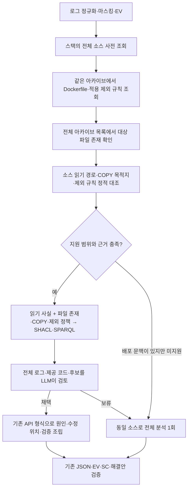

# 배포 구성에 근거한 해결안 제안

2026-10-03. `graph_compact`의 파일 읽기 진단을 **배포 원인 후보 → 수정 대상·위치 → 검증**으로 확장했다. 백엔드 요청과 `diagnosis-result.v3` 공개 스키마는 그대로이며, 기존 `AGENT_DIAGNOSIS_MODE=graph_compact` 설정으로 활성화한다. 기본값과 `.env`는 변경하지 않는다.

## 바뀐 결과

`test_project`의 제공 소스에서는 `/app/data/tasks.json`을 필수로 읽지만 Dockerfile은 `package.json`, `src`, `public`만 복사한다. 대상 파일이 아카이브에 있고 적용되는 제외 규칙에도 걸리지 않는 경우, 읽기 실패(H1, direct)에 **Dockerfile의 명시적 COPY 누락 후보(H2, supported)**를 추가한다. 실제 배포 이미지와 동일한 빌드 문맥인지까지 확인한 것은 아니다.

해결안은 실행 중 컨테이너에 파일을 복사하는 일반 안내에서 다음과 같은 저장소 수정 제안으로 구체화된다.

- 대상: `Dockerfile`, `target_known=true`, `kind=configuration`.
- 위치: 읽은 파일 5줄의 `COPY --chown=node:node public ./public` 바로 뒤.
- 추가할 내용: `COPY --chown=node:node data/tasks.json ./data/tasks.json`.
- 조건: 동일 Dockerfile·빌드 문맥, 이미지에 포함할 승인된 정적 초기 데이터, 가리는 마운트 없음.
- 검증: 재빌드, 실행 사용자 읽기·내용·데이터 형식, 앱 기동·상태·데이터 기능 검사.
- 롤백: 추가 COPY 철회 및 이전 정상 이미지 복귀, 변경된 영속 데이터 보존.

전체 데이터 디렉터리 대신 누락된 파일 하나만 복사해 불필요한 데이터 포함을 줄인다. 내용의 안전성·형식은 사람이 확인해야 한다. 외부 응답의 `snippet_kind=template`을 유지한다. 정확한 위치에 연결한 **검토용 템플릿**이며 검증된 diff, 자동 패치, PR·머지·배포 실행 기능은 아니다. 프런트엔드가 `kind=code`만 AI 수정 대상으로 허용한다면 이 구성 변경은 여전히 자동 수정 대상이 아니다.

2026-10-04 원격의 사람 개입 사유 표시 변경과 통합했다. Dockerfile 해결안도 LLM의 `uncertainty`를 `remediation.reason`에 그대로 유지한다. 이 필드는 화면의 ‘사람의 조치가 필요해요’ 설명에 사용되며, 서버 실행 여부만 알리는 고정 문구로 덮어쓰지 않는다. 수정안·적용 조건·검증·롤백과 공개 응답 스키마는 유지한다.

## 내부 처리



- 동일 요청의 S3 다운로드와 tar 순회를 재사용한다. 관련 소스 1개와 Dockerfile, 적용되는 ignore 파일 1개로 최대 3개 파일을 읽는다. 대상 데이터 파일은 **목록의 일반 파일 존재 여부만** 확인하고 내용을 모델에 보내지 않는다.
- `Dockerfile.dockerignore`가 있으면 `.dockerignore`보다 우선한다. 없음을 확인한 아카이브, 빈 파일, 읽지 못한 파일, 링크를 구분한다. 일부 파일만 담긴 inline `source_snapshot`의 누락을 저장소 전체의 부재로 해석하지 않는다.
- 파일당 전체 120줄, 전체 SC 근거 8KiB 한도를 유지한다. 범위 초과·마스킹·읽기 실패가 있으면 해당 배포 후보를 만들지 않는다. SC ID는 전체 선택 파일에 한 번 부여한다.
- `ReadFailure`·`StackFrame`·`SourceRead`에 `RepositoryEntry`·`CopyCoverage`·`IgnorePolicy`를 추가한다. `docker-copy-omission.v1` SPARQL 규칙은 진단 scope, 대상 경로, 저장소 경로, 아카이브 SHA-256이 일치할 때만 관계를 연결한다. 구조는 규칙 적용 전후 SHACL로 검증한다.
- 데이터 존재와 비어 있거나 없는 ignore 파일의 출처는 아카이브 해시·목록이며, 읽지 않은 데이터 내용에 가짜 SC ID를 붙이지 않는다. Dockerfile/ignore의 실제 텍스트는 SC로 연결된다. 원래 아카이브 전체를 모델에 노출하지 않는다.
- 모델 내부 계획에 `add_docker_copy`를 추가했다. 해당 후보가 없으면 선택할 수 없고, 후보가 있는데 상충하는 계획을 내거나 보류하면 기존 전체 소스 분석으로 한 번 전환한다. 인증·통신 오류 자동 재호출은 하지 않는다.
- 그래프 보관은 기존 shadow 정책을 따른다. 새 후보·규칙 해시·TTL은 내부 보고서에 포함되며, public 응답에 별도 그래프 필드는 추가하지 않는다.

Docker의 [COPY 문법](https://docs.docker.com/reference/dockerfile/#copy)과 [빌드 문맥·제외 규칙](https://docs.docker.com/build/concepts/context/#dockerignore-files)을 기준으로 제한된 구문만 해석한다. 완전한 Docker 빌드 해석기가 아니다.

## 빠른 계획을 만드는 범위와 보류 조건

지원: 버전이 명시된 `node:<버전>-alpine`, `bookworm`, `bullseye` 계열, 단일 FROM·절대 WORKDIR, 단순 리터럴 COPY, `--chown=node:node`로 복사된 앱 소스, `USER node`, 직접 Node 스크립트를 실행하는 JSON CMD, 단순 리터럴 제외 규칙. 소스 파일이 실제 스택 경로로 복사되는지도 대조한다.

다음은 새 고정 COPY 계획을 만들지 않고 제공된 소스로 일반 분석한다.

- 이미 대상을 복사하는 지시, `COPY . .`, 목적지 이름을 바꾸는 복사, 앱 소스를 덮을 가능성이 있는 복사.
- 대상 파일 부재, 읽지 못한 ignore, 제외된 대상, wildcard·negation 등 미지원 제외 문법.
- 멀티스테이지, RUN·ADD·ARG·ENTRYPOINT·VOLUME, COPY `--from`·`--link` 등 미지원 옵션, JSON COPY, 변수 경로, 사용자 정의 기반 이미지·파서 지시문.
- 링크·특수 파일, 모순된 아카이브 경로, 마스킹·소스 예산 초과, 실제 앱 경로와 WORKDIR/COPY의 불일치.

사전 조회 조건을 충족하지 않는 오류는 기존 adaptive 라우팅을 따른다. Dockerfile이 없는 기존 파일 읽기 사례의 일반 공급 계획도 유지한다. 실제 런타임 이미지, 원격 마운트, 데이터 소유·영속성 계약은 여전히 독립 확인이 필요하다.

## 검증 결과

자동 회귀 테스트 469개 통과(기존 426개 + 배포 구성 43개). 공개 스키마 동일성, 요청별 S3 1회 다운로드, 근거 ID 연결, 부정 사례, 다른 scope·아카이브의 규칙 결합 거절, 보류 후 기존 소스 재사용을 확인한다. 자동 테스트의 모델은 모의 응답이므로 LLM 정확도로 해석하지 않는다.

별도로 실제 `test_project` 커밋 `7f061109e2d2b010c38c2c7e2f016df4842bf0d8`의 Dockerfile COPY 목록을 임시 디렉터리에 재현했다. 원본은 시작 시 ENOENT와 종료 코드 1, 제안한 한 줄을 반영한 복사본은 초기 작업 3개 유지와 앱 생성 성공을 확인했다. 저장소 원본은 변경하지 않았다. 이는 격리된 Node 실행 검증이며 Docker 엔진 빌드나 HTTP 상태 검사 결과는 아니다.

### 실제 LLM 호출

고정 데이터: `evaluation/packaging.v1.json`. 예제 저장소의 제공 파일과 두 합성 대조 사례이며, 운영 장애 정답 집합은 아니다. 각 1회 실행, 모델 `gpt-6.1-sol`, Fast 요청/응답, 기존 로컬 프로필 사용. S3는 fixture, 모델 API는 실제 호출. 시간은 로컬 진단 API 전체 요청이며 운영 수집·S3·프런트 폴링은 포함하지 않는다.

| 사례 | 응답 시간 | LLM 호출 | 입력 / 출력 토큰 | 결과 검토 |
| --- | ---: | ---: | ---: | --- |
| COPY 누락 | 4.478초 | 1 | 2,840 / 212 | 축약 채택. Dockerfile 5줄 뒤 단일 파일 COPY, H1/H2 구분, 적용 조건·검증·롤백 제공 |
| 이미 COPY 있음 | 12.752초 | 1 | 7,848 / 1,043 | 전체 분석. COPY 재추가를 제안하지 않고 실제 이미지·마운트 확인을 요청 |
| ignore에 대상 제외 | 18.369초 | 1 | 7,837 / 1,940 | 전체 분석. COPY만 추가하지 않고 ignore 제외 규칙 수정도 함께 제안 |

출력 토큰은 제공자 usage 값으로 추론 토큰을 포함한다. COPY 누락의 그래프는 117 triple·6개 사실·2개 후보였고 첫 초기화 포함 172.706ms였다. 동시 부하·운영 p95 측정값이 아니다.

계약 검증은 3/3 통과했다. 사전에 선언한 상태 `diagnosed` 일치는 2/3이며, 이미 복사된 대조 사례는 `insufficient_evidence`를 반환했다. 이 차이를 숨기거나 사후 정답을 바꾸지 않았다. 작업 에이전트가 읽은 의미상으로는 실제 배포 원인을 확인할 수 없다는 적절한 보류였으나, 독립·블라인드 품질 평가는 아니다. 10초 이내 완료는 1/3으로, 모든 오류를 최대 10초에 처리한다는 보장은 없다.

```sh
PYTHONPATH=src python evaluation/benchmark_graph_compact.py --live \
  --env-file .env --dataset evaluation/packaging.v1.json \
  --output-dir results/packaging-new-run --service-tier fast \
  --modes graph_compact --limit 3
```

원본 측정은 `results/packaging-20261003/final/`의 결과 JSON, 모델 입력·출력, 그래프 보고서 및 `quality_review.json`에 보관한다(Git 제외). 샌드박스의 최초 연결 실패는 `connection-check/`에 별도 보존하고 성능 집계에서 제외했다. 이전 `GRAPH_COMPACT.md`의 8개 사례 수치는 배포 구성 확장 전 결과이며 이번 수치와 합산하지 않는다.
