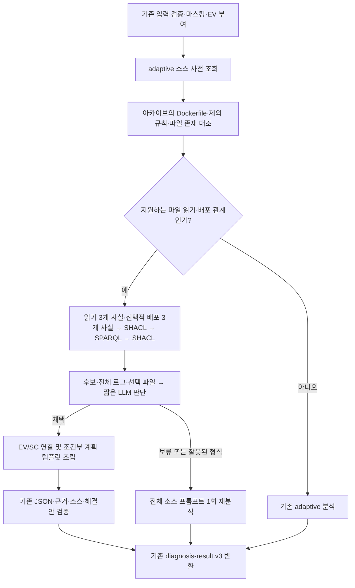

# graph_compact: 그래프 후보 검토와 응답 조립

작성일: 2026-10-03. `POST /diagnose`의 백엔드 입력과 `diagnosis-result.v3` 출력 규격을 유지하는 선택형 내부 모드다. 자동 수정·명령 실행은 추가하지 않는다. 기존 `adaptive`와 같은 모델로 실제 LLM을 호출해 비교한다.

## 적용과 범위

2026-10-04 확장: 이 모드에서도 문법·컴파일·일반 런타임 오류의 파일·행·열을 추출해 관련 소스와 함께 한 번 분석한다. 이 일반 경로는 Dockerfile이나 파일 읽기 그래프를 만들지 않는다. 아래 ‘빠른 경로’의 제한과 기존 실측은 짧은 그래프 판단·템플릿 경로에 관한 내용이다. 상세는 [ERROR_LOCATIONS](ERROR_LOCATIONS.md)를 참고한다.

```dotenv
AGENT_DIAGNOSIS_MODE=graph_compact
```

설정 후 API 서버를 재시작한다. `adaptive`로 되돌리면 기존 소스 사전 조회 방식, `standard` 또는 미설정이면 로그 우선 방식이다. 기본값은 바꾸지 않았다. 이번 개발에서는 로컬 `.env`의 기존 `adaptive` 및 배포 서버 설정을 변경하지 않았다. 로컬 CLI의 v2 진단과 대화형 OpenCode 화면은 이 설정의 대상이 아니다.

`OPENAI_SERVICE_TIER`는 별개 설정이다. 이번 비교는 양쪽 모두 `fast`를 요청하고 응답 티어도 확인한다. 기본 티어의 속도와 혼합하지 않으며, Fast 결과를 모든 계정·모델의 결과로 일반화하지 않는다.

현재 빠른 경로는 **Node.js의 한 종류 ENOENT 파일 읽기 오류**에 한정한다. 기존 `adaptive`의 사전 조회 조건을 만족하고, 전체 첫 애플리케이션 파일(120줄 이하, 소스 예산 내)에서 다음 중 하나가 확인되어야 한다.

- `import { readFileSync } from 'node:fs'`와 관찰된 스택 줄의 단일 호출, 문자열 절대 경로.
- 같은 import/call과 `const file = new URL('../data/tasks.json', import.meta.url)` 형태. 관찰된 런타임 모듈 경로로 해석한 경로가 ENOENT 경로와 정확히 같아야 한다.

별칭, 동적 경로·옵션, 복잡한 바인딩, try/catch, 지원하지 않는 구문, 다른 소스 경로, 다중 오류·출처/스트림, 회복 신호는 기존 경로로 보낸다. 소스 인식기는 제한된 토큰 인식기이며 완전한 JavaScript AST·제어 흐름 분석기가 아니다. 실제 커밋 일치나 예외의 최종 전파를 증명하지 않는다.

## 배포 구성 확인 확장

같은 아카이브에서 Dockerfile·적용 제외 규칙·대상 파일 존재를 확인하고, 지원하는 경우 파일 읽기 후보에 조건부 Docker COPY 누락 후보를 추가한다. 상세 조건·수정 위치·부정 사례·실측은 [배포 해결안 확장](DEPLOYMENT_REMEDIATION.md)에 기록했다. 아래 최초 8개 사례 측정은 이 확장 전 결과다.

## 처리 흐름



생성하는 사실은 `ReadFailure(ENOENT, 대상 경로)`, `StackFrame(파일, 줄)`, `SourceRead(같은 경로, 같은 파일·줄)`이다. SPARQL은 같은 tenant/project/deployment/attempt 및 출처·단계·스트림 범위 안에서만 연결한다. 후보는 “제공 로그와 소스의 파일 읽기 경로가 일치한다”이며 “Docker 패키징 누락이 실제 근본 원인이다”가 아니다. SHACL은 구조·필수 속성·참조를 검사하며 원인의 참·거짓을 보장하지 않는다.

기존 shadow 그래프는 진단 결과를 받은 뒤 검증·보관하는 용도이고, 기존 assist는 전체 입력에 추론 문맥을 더하는 방식이다. 이번 모드는 LLM **앞단에 이 오류 유형의 작은 그래프를 따로 생성**해 압축 판단에 사용한다. 기존의 모든 온톨로지 후보를 축약 프로토콜로 전환한 구현은 아니다.

LLM 입력에는 후보만 보내지 않는다. 준비된 근거 묶음의 **모든 서로 다른 로그 문장**, 동일 문장의 모든 발생 EV ID·시간·순서, 선택한 첫 소스 파일 전체와 제공된 배포 설정, 기존 입력 한계를 유지한다. 반복 문장만 묶는다. 수집·전처리 단계에서 이미 누락되거나 예산으로 제외된 데이터까지 복구한다는 뜻은 아니다.

LLM은 `accept/defer`, 후보 ID, 계획 선택, 한국어 요약·불확실성, 반대 근거 ID를 반환한다. 관찰된 실패를 채택하더라도 미제공 후속 기록의 회복 여부, 커밋 일치, 마운트·공급·영속성 계약은 미확인으로 남긴다. 예상된 테스트 오류나 반대 근거가 있으면 보류한다.

서버는 채택된 경우 검증한 EV/SC와 조건부 파일 공급 계획을 조립한다. 출처·내용을 검증한 정상 원본, 실행 환경·공급 시점·마운트·권한 확인, 기존 파일/링크 덮어쓰기 방지, 원래 오류·상태·기능 검증, 데이터 보존 및 롤백 조건이 포함된다. 계획은 코드 패치가 아닌 예시 템플릿이며 실행하지 않는다. 상세 절차가 서버 템플릿이라는 점은 `source_analysis.limitations`에 표시한다.

속도 절감의 주요 변화는 **전체 상세 JSON을 LLM이 매번 작성하지 않게 한 것**이다. 그래프 요약만 추가하는 방식과 달리 내부 출력 규격도 짧게 바꿨다. 따라서 그래프, 입력 압축, 짧은 판단 규격, 서버 템플릿 각각의 독립적인 속도 효과를 이번 비교로 분리할 수는 없다.

## 실패·동시 실행·보관

- 그래프 생성은 앱당 동시에 한 작업만 수행하며 대기열을 만들지 않는다. 최대 0.5초 기다린 뒤 미완료·오류·busy이면 기존 분석으로 전환한다. 실행 중인 스레드는 강제 종료하지 않으며 실제 종료 전까지 슬롯을 점유한다. 작은 입력에 대한 지연 제한이며 하드 CPU 제한은 아니다.
- SHACL 부적합·미지원 소스·프롬프트 예산 초과는 축약 LLM 호출 전에 복귀한다.
- LLM 보류·잘못된 후보·형식·근거 검증 실패는 기존 전체 소스 분석을 **한 번** 호출한다. 이미 읽은 소스를 사용하며 로그 분석부터 다시 시작하지 않는다. 이 분기는 최대 2회 호출이고, 추가 비용·시간도 기존 `execution` 합계에 포함한다.
- 제공자 인증·통신·시간 초과·요청 제한 오류는 자동 재호출하지 않는다.
- 채택한 축약 경로에서는 기존 `AGENT_REASONING_MODE=assist`를 중복 실행하지 않는다. 축약 경로에서 빠져나오면 기존 reasoning 설정을 따른다. `AGENT_KG_MODE=shadow`는 기존 비동기 결과 검증·보관으로 계속 사용 가능하다.
- 그래프 TTL, 규칙·shape 해시, 후보, 생성 시간, 채택/보류 결과는 내부 보고서에 보관한다. shadow가 활성화되고 기존 크기·실행 상한 내에서 저장되면 `record.json.gz`의 `reasoning`에 포함된다. shadow가 꺼져 있으면 별도 영속 저장은 하지 않는다. 실험 스크립트는 각 사례의 `.graph.json`을 저장한다.
- API 스키마와 모델·추론 노력·출력 한도는 그대로다. 외부 응답에는 기존 분석·해결안·근거 필드를 채우고 기존 검증기를 적용한다. 모든 모델이 같은 속도나 품질을 낸다고 검증한 것은 아니다.

## 비교 방법

고정 데이터셋: `evaluation/graph_compact.v1.json` (8개 합성 사례, 호출 전에 기대 상태·경로·품질 검토 기준 선언).

SHA-256: `e62df60e599f79b90b633236756e80615fc28ef2ddaf86b333c725c04bc8fc0d`

모델 `gpt-6.1-sol`, reasoning `low`, 출력 한도 `4096`, 요청 티어 `fast`. 두 모드에 동일한 백엔드 payload와 소스 아카이브 바이트를 제공하고 사례마다 호출 순서를 번갈아 실행한다. 각 결과는 별도 실제 LLM 호출이며 다른 모드의 응답을 재사용하지 않는다. 모델 API는 실제 서비스, S3는 고정 fixture다. 로컬 API 요청 시작부터 JSON 결과 수신까지 측정하므로 운영 S3·백엔드 조회·프론트 폴링 지연은 포함하지 않는다. 실험 앱의 기존 KG shadow/assist는 양쪽 모두 비활성이다.

```sh
PYTHONPATH=src python evaluation/benchmark_graph_compact.py --live \
  --env-file .env --output-dir results/graph-compact-new-run --service-tier fast
```

실제 API 사용량이 발생한다. 기존 결과 디렉터리는 덮어쓰지 않으며 최대 32회 제공자 호출로 제한한다. `--limit 1`은 첫 사례 쌍만 실행한다. 키는 환경 파일에서 읽고 결과에 저장하지 않는다. `summary.json`에는 데이터·코드·리소스 해시, 호출·토큰·시간·상태를 기록한다. `.model.json`에는 마스킹된 모델 입력과 실제 출력이 있어 의미를 재검토할 수 있다. 합성 자료로만 실행한 이번 결과와 달리 실제 장애 입력의 결과 파일은 기존 민감정보 보관 정책을 적용해야 한다.

자동 확인은 공개 계약, 성공 여부, 상태 일치, 한국어 포함 여부다. **상태 일치율이나 SHACL 통과율을 실제 장애 정확도로 부르지 않는다.** 의미 평가는 작업 에이전트가 선언된 기준으로 원인 범위, 반대 근거, 불확실성, 소스 연결, 조건부 해결안, 데이터 보존, 검증·롤백을 읽고 기록한다. 독립적인 사람 평가·블라인드 평가가 아니며 사례당 각 모드 1회라 품질 동등성·운영 p95를 입증하지 못한다.

## 2026-10-03 최초 버전 실측 — 배포 구성 확장 전

같은 오류군의 변형 4개에서 축약 채택이 일어났다. 모델·티어는 양쪽 모두 동일하며 아래는 최종 비교 실행만의 결과다.

| 지원 사례 4개 | adaptive | graph_compact | 변화 |
| --- | ---: | ---: | ---: |
| 응답 시간 중앙값 | 20.471초 | 3.011초 | 85.3% 감소 |
| 응답 시간 최댓값 | 21.395초 | 3.387초 | 이번 4건 모두 10초 이내 |
| 평균 입력 토큰 | 7,376 | 1,983 | 73.1% 감소 |
| 평균 출력 토큰(추론 포함) | 1,770.75 | 198.50 | 88.8% 감소 |
| LLM 호출/사례 | 1 | 1 | 동일 |
| 10초 이내 완료 | 0/4 | 4/4 | 지원 사례에서 목표 달성 |

그래프 생성·SHACL·SPARQL 시간은 첫 초기화 포함 123.176ms, 이후 이 4건에서는 6.939~7.891ms였다. 예상 테스트 오류의 그래프는 8.596ms였다. 전체 Python 프로세스 메모리·운영 동시 부하를 측정한 값은 아니다.

| 사례 | adaptive | graph_compact | 최종 경로와 의미 검토 |
| --- | ---: | ---: | --- |
| tasks.json 부재 | 21.395초 | 3.149초 | 축약 채택, 직접 읽기 실패·배포 원인 미확정 |
| catalog.json 부재 | 19.409초 | 2.756초 | 축약 채택, 변경된 대상 경로 반영 |
| 반복 스택 3개 | 20.507초 | 2.873초 | 축약 채택, 15개 EV 발생 보존 |
| 절대 경로 읽기 | 20.434초 | 3.387초 | 축약 채택, 함수명/소스 선언 차이의 불확실성 유지 |
| 동일 출처 회복 | 8.124초 | 8.647초 | 기존 분석, 미회복 장애로 확정하지 않음·수정안 없음 |
| 다른 앱 정상 로그 | 40.832초 | 36.977초 | 기존 분석 2회, 실패 앱 회복으로 오인하지 않음 |
| 소스의 대상 파일 불일치 | 15.399초 | 12.918초 | 호출 전 unsupported 복귀, 양쪽 근거 부족·수정안 없음 |
| 예상된 테스트 오류 | 8.195초 | 11.185초 | 축약 LLM 보류 후 재분석, 실제 장애로 확정하지 않음 |

전체 8개 사례 중앙값은 19.922초 → 6.017초, 최댓값은 40.832초 → 36.977초였다. 10초 이내 완료는 2/8 → 5/8이다. 실제 축약 채택률은 이 데이터셋에서 4/8이며 운영 적용률 예측값이 아니다. 제공자 호출 합계는 9회 → 10회다. **모든 장애를 최대 10초로 제한한 구현은 아니다.**

기존 분석으로 돌아간 대조 4개의 중앙값은 11.797초 → 12.052초였다. 특히 예상 테스트 오류는 보류 호출이 추가되어 2.990초 느려졌다. 나머지 동일 경로 사례의 시간 차이는 모델 출력 길이·서비스 변동도 섞이므로 그래프가 가속했다고 해석하지 않는다.

### 품질 검토

두 모드 모두 공개 계약·상태 기대값 검증 8/8을 통과했고, 작업 에이전트가 읽은 사전 선언 핵심 기준도 각각 8/8 사례에서 충족했다. 평가 내용은 직접 실패와 근본 원인의 구분, 회복·출처·테스트 문맥, 불일치 발견, 미확인 사항 표시, 조건부 해결안 및 데이터 보존·검증·되돌리기다. 특히 **관계 그래프가 생성되더라도 테스트 문맥을 보고 LLM이 보류하는 실제 호출**을 확인했다.

품질이 완전히 같은 것은 아니다. 축약 채택 결과는 `JSON.parse`/배열 `map` 등 파일별 상세 설명과 구체적인 배열 검증 예시 대신 “실제 형식·항목 계약을 확인”하는 공통 절차를 제공한다. `source_findings`는 경로·줄의 일치 설명으로 좁아지고, 분류도 보수적인 `other`로 조립한다(adaptive는 이번 직접 실패 사례에서 `configuration`). 수정 계획의 세부 맞춤성과 분류 일관성이 중요하면 `adaptive`의 이점이 남는다. 전체 API 필드 구조를 유지했다는 것과 내용이 동일하다는 것은 다르다.

따라서 이번 결과는 **지원하는 좁은 오류군에서 핵심 진단 기준을 유지하며 빠르게 만든 개발용 검증**이다. 이 8건은 실제 운영 장애의 독립 정답 집합이 아니고, 4건은 같은 오류군의 변형이다. 품질 동등성이나 실제 장애 정확도 100%를 의미하지 않는다. 운영 표본과 별도 평가자가 정한 정답, 반복 실행으로 채택·보류율과 오류율 및 p95를 추가 측정해야 한다.

### 초기 실험도 보존

처음에는 `accept`가 현재까지 미회복임을 요구해, 로그 잘림이 있는 지원 4건을 전부 보류했다. 그때 graph_compact는 22.879~26.411초로 추가 호출 때문에 느려졌다. 관찰된 실패와 현재 상태의 확정을 구분하도록 프롬프트를 수정하고, 같은 고정 데이터셋으로 양쪽 모두 다시 호출한 것이 위 최종 결과다. 초기 실행은 다른 앱 사례 도중 중단했으며 최종 집계에 합치지 않았다. 개발 중 같은 데이터를 재사용했으므로 이 결과를 미공개 시험 세트 성적으로 제시하지 않는다.

## 최초 버전 검증·파일 위치

- 전체 테스트 **426개 통과**(기존 395개 + 신규 31개), Ruff 통과.
- 그래프·scope·근거 무결성, 경로·동적 소스 거절, 마스킹, 보류/잘못된 응답 후 1회 복귀, 제공자 오류 재호출 금지, timeout/busy, 기존 OpenAPI 일치 검증.
- 격리된 임시 디렉터리에서 검토된 Node 복사 템플릿만 실행해 신규 파일 생성, 기존 파일 및 링크 덮어쓰기 거절을 확인했다. 모델이 생성한 명령이나 운영 경로는 실행하지 않았다.
- wheel 빌드 성공 및 새 Python 모듈·TTL·SPARQL·JSON 템플릿 패키지 포함 확인.
- 구현: `graph_compact.py`, `knowledge/compact.py`, `knowledge/node_source.py`, `knowledge/compact_shapes.ttl`, `knowledge/rules/compact_file_read.rq`, `agent/compact_file_plan.json`.
- 최종 원본: `results/graph-compact-20261003/final/summary.json`, `quality_review.json`, 사례별 `.json`/`.model.json`/`.graph.json` (결과 디렉터리는 기존 Git 제외 대상).
- 초기 보류 실험: 같은 결과 디렉터리의 `pilot/`; 최초 샌드박스 통신 실패: `connection-check/`. 성능 집계에서는 제외했다.

실제 서버에는 코드 반영과 `AGENT_DIAGNOSIS_MODE=graph_compact` 설정·재시작이 필요하다. 현재 서버는 변경하지 않았다. 이번 범위에서는 ENOENT 파일 읽기 유형에 한해 선택적으로 시험할 수 있으며, 모든 장애에서 10초와 기존 상세도를 동시에 보장하는 기본 모드로 판단할 근거는 아직 부족하다.
