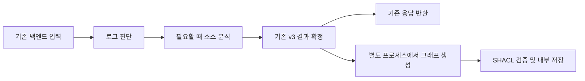

# 지식 그래프 병행 검증: 1차 구현

기존 백엔드 입력과 `diagnosis-result.v3` 출력은 유지하고, **이미 마스킹된 근거와 기존 진단 결과**를 RDF 그래프로 옮겨 SHACL로 검사합니다. 그래프가 LLM의 판단을 바꾸지는 않습니다. 기본값은 `off`이며, `shadow`에서만 동작합니다.

## 처리 흐름



결과가 확정되면 마스킹한 작은 레코드를 바이트로 복사하고 관찰 작업을 제출한 뒤 기존 응답을 반환합니다. 그래프 생성·SHACL 검증·저장을 기다리지 않습니다. 작업 완료 시간인 내부 `observer_elapsed_ms`는 HTTP 추가 지연이 아닙니다. `last_submission.elapsed_ms`는 제출 준비 시간을 측정하며, 기존 `execution.elapsed_ms`는 원래 진단 시간의 의미를 유지합니다. 처리 슬롯이 없으면 대기열에 넣지 않고 그래프 작업을 생략합니다.

- 로그 우선 분석, 조건부 소스 다운로드, 최대 두 번의 모델 제출을 유지합니다.
- 기존 JSON Schema, 프롬프트, 근거 선택, HTTP 상태 코드에 그래프 정보를 추가하지 않습니다.
- 검증 위반은 저장·기록하며 기존 진단 결과를 거절하거나 수정하지 않습니다.
- 프로세스 오류, 쓰기 실패, 상한 초과, 시간 초과도 기존 응답에 영향을 주지 않습니다. 제출한 작업은 응답 뒤에도 계속 처리합니다. 정상 서버 종료에서는 제한 시간 안에 작업을 마친 뒤 관찰 프로세스를 종료합니다. 강제 종료 시 미완료 작업이 유실될 수 있는 관찰용 경로입니다.
- 직접 호출과 API의 OpenCode 실행 경로에 공통 적용됩니다. 대화형 OpenCode 화면과 기존 v2 CLI는 이번 연결 범위에 포함하지 않습니다.

## 활성화

Python 3.11 이상에서 변경된 의존성을 설치하고 기존 API를 재시작합니다. 프로젝트에서 사용하는 Python 환경에 설치해야 관찰 자식 프로세스도 같은 패키지를 사용합니다.

```bash
python -m pip install -r requirements-dev.lock
python -m pip install --no-build-isolation --no-deps -e .
```

`.env` 또는 API 프로세스 환경에 다음 값을 설정합니다.

```dotenv
AGENT_KG_MODE=shadow
AGENT_KG_OUTPUT_DIR=.runtime/knowledge
AGENT_KG_TIMEOUT_SECONDS=5
AGENT_KG_MAX_CONCURRENT=1
AGENT_KG_MAX_TRIPLES=10000
```

| 설정 | 기본값 | 허용 범위·의미 |
|---|---:|---|
| `AGENT_KG_MODE` | `off` | `off`, `shadow` |
| `AGENT_KG_TIMEOUT_SECONDS` | 5 | 0.05–30초, 관찰 작업 시작·검증·저장 전체 |
| `AGENT_KG_MAX_CONCURRENT` | 1 | API 프로세스마다 최대 1–2개의 재사용 관찰 프로세스 |
| `AGENT_KG_MAX_TRIPLES` | 10000 | 그래프별 100–20000개 트리플 |
| `AGENT_KG_OUTPUT_DIR` | `.runtime/knowledge` | 내부 저장 디렉터리 |

관찰 프로세스로 보내는 레코드는 256 KiB, 작업별 압축 산출물 전체는 4 MiB로 제한합니다. 별도 프로세스 사용은 이벤트 루프의 RDF/SHACL 연산을 분리하지만 CPU나 전체 메모리의 하드 상한을 설정하지는 않습니다. 배포 컨테이너의 자원 제한은 별도로 설정합니다. API를 여러 worker로 실행하면 각 worker의 관찰 슬롯이 합산됩니다.

관찰 프로세스는 처음 필요할 때 시작하고 재사용합니다. 고정 SHACL-SPARQL 쿼리는 실행 계획만 캐시하고, 그래프와 `$this` 바인딩은 작업별로 새로 구성합니다. 검증 규칙과 SHACL 파일은 변경하지 않았습니다. 100개 작업 뒤에는 프로세스를 교체하며 오류·시간 초과·직접 관찰 호출 취소 시에도 해당 프로세스를 버립니다. 유휴 프로세스의 메모리는 서버 종료까지 유지됩니다.

`off`에서는 그래프 레코드·프로세스를 생성하지 않고 RDFLib/pySHACL을 API 프로세스에 import하지 않습니다. 되돌릴 때는 `AGENT_KG_MODE=off`로 변경하고 재시작합니다.

Docker 이미지에는 온톨로지·SHACL 파일과 라이브러리가 포함됩니다. 기본 내부 경로는 `/app/.runtime/knowledge`이며 실행 사용자 `agent`가 쓸 수 있습니다. 컨테이너 종료 후에도 보관하려면 해당 경로에 volume을 연결합니다. bind mount를 사용하면 호스트 디렉터리의 소유권을 실행 사용자에 맞춰야 합니다.

## 그래프 의미와 검증 범위

네임스페이스는 `urn:iris:knowledge:v1:`, 버전은 `iris-knowledge.v1`입니다. `ontology.ttl`과 `shapes.ttl`의 SHA-256을 작업별로 저장합니다. OWL 추론, 외부 온톨로지 가져오기, SHACL-JS 실행은 사용하지 않습니다. SHACL-SPARQL은 저장소에 고정된 관계 범위 및 코드 줄 범위 검사만 사용합니다.

| 대상 | 저장·검사 내용 |
|---|---|
| 배포 시도 | tenant/project/deployment/attempt ID, 백엔드 service ID |
| 로그 근거 | 기존 EV ID, 마스킹한 텍스트, 백엔드 log ID, 출처·줄 메타데이터 |
| 코드 근거 | 선택된 SC ID, 파일·줄 위치, 스냅샷 연결 |
| 분석 단계 | `logs`와 `source`를 구분한 관찰·가설·확인·해결안 |
| 관계 | 지지 근거, 반대 근거, 관찰·가설 연결, 소스 발견의 로그·코드 연결 |

같은 `H1`이라도 `logs:H1`과 `source:H1`은 다른 노드입니다. 진단 ID별 네임스페이스로 배포 사이의 ID 충돌을 막고, 관계 대상의 배포 시도·분석 단계가 일치하는지 검사합니다. 없는 근거 참조, 지지·반대 근거 중복, 필수 관계 누락, 잘못된 코드 파일·줄 범위 등을 검출합니다. 선언된 검증 대상의 타입이 빠져 검사 대상에서 사라지는 경우를 확인하기 위해 **타깃 커버리지**도 함께 계산합니다.

`supports`와 `opposes`는 기존 모델이 채택한 근거 관계입니다. 인과관계가 입증됐다는 뜻이 아닙니다. 가설은 항상 `confirmation=unverified`로 저장하고, 제공된 커밋 SHA는 `caller_supplied` 상태를 유지합니다. 그래프가 저장됐거나 SHACL에 통과했다고 실제 장애 원인·커밋 일치가 확인된 것은 아닙니다.

## 저장과 운영 관찰

진단 ID의 SHA-256을 디렉터리 이름으로 사용합니다.

```text
.runtime/knowledge/<diagnosis-id-sha256>/
  record.json.gz
  evidence.ttl.gz
  diagnosis.ttl.gz
  evidence-validation.ttl.gz
  diagnosis-validation.ttl.gz
  metadata.json
```

`evidence`는 입력 근거 그래프, `diagnosis`는 근거와 분석 관계를 합친 그래프입니다. `record`는 온라인 경로에서 로그·소스 두 단계의 채택된 분석을 보존합니다. 전체 원본 로그·소스 아카이브·미선택 코드·다운로드 URL은 저장하지 않습니다. 저장 직전에 기존 마스킹 함수를 다시 적용합니다.

`metadata.json`에는 버전·해시, 검사 대상 수·커버리지·위반, 노드 통과율, 생성·검증·직렬화 시간, CPU·최대 RSS, 압축 산출물 크기가 들어갑니다. `worker_job_cpu_ms`는 작업별 CPU, 기존 `worker_cpu_ms`와 최대 RSS는 해당 프로세스의 누적·최대 수치입니다. 파일은 임시 디렉터리에서 작성한 뒤 최종 이름으로 변경합니다. 동일 진단 ID는 덮어쓰지 않습니다. Unix에서 새 디렉터리와 파일은 각각 0700/0600으로 생성합니다.

강제 종료가 쓰기 도중 발생하면 `.pending-*` 디렉터리가 남을 수 있습니다. 이를 완료된 그래프로 집계하지 않습니다. **전체 디스크 용량 제한·자동 보관 기간·자동 정리 기능은 아직 없습니다.** 해커톤 환경에서는 측정에 필요한 기간만 보관하고, 실행 중인 작업이 없는 상태에서 오래된 작업·잔여 임시 디렉터리를 정리합니다.

서버 로그에는 `submitted`, `recorded`, `failed`, `timed_out`, `busy`, `too_large` 상태만 출력합니다. `submitted`는 제출, `recorded`는 저장 성공이며 SHACL 통과 여부는 메타데이터의 `conforms`와 `coverage`를 함께 확인합니다. 내부 카운터는 API 프로세스 메모리에 있으며 별도 공개 API·영속 모니터링 시스템은 추가하지 않았습니다. ASGITransport나 관찰 클래스를 직접 사용하는 테스트·평가에서는 종료 전에 `await observer.aclose()`로 작업과 프로세스를 정리합니다. 실제 API 서버는 lifespan에서 자동 처리합니다.

## 모델을 호출하지 않는 평가

기존에 저장된 `diagnosis-result.v3` JSON을 사용합니다. `result` 필드로 감싼 파일도 받습니다. 기존 v2 CLI 결과는 입력으로 받지 않습니다. 아래 명령은 모델이나 S3를 호출하지 않습니다.

```bash
python evaluation/run_knowledge.py --input results/case-001.json results/case-002.json --output-dir results/kg-replay-001
python evaluation/benchmark_knowledge.py --input results/case-001.json --output-dir results/kg-benchmark-001 --runs 10
```

출력 디렉터리는 새 이름을 사용합니다. 공개 v3 응답에는 최종 분석만 있으므로 오프라인 재생으로 이전 로그 단계의 가설을 복원할 수 없습니다. 온라인 `shadow` 레코드는 두 단계의 분석을 직접 캡처합니다.

`benchmark_knowledge.py`는 첫 작업과 재사용 작업의 처리 시간을 구분합니다. 공개 결과와 같은 진단에서 나온 `--stage-record <record.json.gz>`를 전달하면 로그·소스 두 단계 전체를 측정할 수 있습니다. 이 도구는 의도적으로 그래프 완료를 기다리며 HTTP 응답 지연을 측정하지 않습니다.

`run_knowledge.py`는 SHACL 적합성·타깃 커버리지·노드 통과율, 구조적 competency question(CQ), 관계 목록을 기록합니다. 구조적 CQ는 근거 추적·코드 위치·단계 구분을 검사하며 실제 인과관계의 정답 평가는 포함하지 않습니다.

검토한 관계 정답이 있으면 `--gold evaluation/knowledge-gold.local.json`을 추가합니다. 다음은 **파일 형식 예시이며 평가용 완전 정답이 아닙니다.**

```json
{
  "case-001.json": {
    "expected_status": "diagnosed",
    "relations": [
      ["logs:H1", "supports", "log:EV000001"],
      ["logs:H1", "observation", "logs:O1"]
    ]
  }
}
```

관계 정밀도·재현율·F1은 `supports`, `opposes`, `observation`, `hypothesis`, `codeEvidence`, `logEvidence` 여섯 관계의 전체 정답 집합과 비교합니다. 코드 발견 노드 표기는 `source:finding:0`부터 시작합니다. 정답 관계를 제공하지 않으면 F1을 만들지 않습니다. 부분 라벨을 전체 정답으로 넣으면 정밀도를 제대로 측정할 수 없으므로 사용하지 않습니다. 예측 그래프에서 정답을 복사하는 평가도 정확도 근거로 사용하지 않습니다.

기존 실제 모델 평가에 그래프를 함께 기록하려면 다음 옵션을 사용합니다. **이 명령은 실제 모델 호출과 비용이 발생합니다.**

```bash
python evaluation/run_backend_envelope.py --env-file .env --output-dir results/backend-shadow-001 --knowledge-mode shadow
```

해당 평가의 S3 전송은 기존 합성 아카이브 모의 전송입니다. 실제 장애 정확도는 별도로 확보한 장애·해결 이력에 대해 원인·근거·다음 확인의 정답을 검토하고, 동일한 사례로 기존 방식과 후속 그래프 적용 방식의 결과를 비교해야 합니다.

## 후속 적용 조건

이번 단계는 관측·검증·저장·평가 준비입니다. 그래프를 프롬프트 문맥 선택에 사용하는 `assist`, 진단을 제한하는 `enforce`, 그래프 DB, 자동 수정은 구현하지 않았습니다. 먼저 실제 장애 라벨을 확보하고 기존 방식의 기준 지표와 자원 사용량을 측정한 뒤 내부 문맥 선택부터 적용합니다. 이때도 외부 요청·응답 규격은 유지합니다.

현재 기능 검사와 로컬 자원 측정 결과는 [2026-10-03 검증 보고서](KNOWLEDGE_GRAPH_TEST_REPORT_2026-10-03.md)를 참고하세요.

실제 OpenAI 모델 7회 호출과 두 단계의 그래프 기록 결과, 로컬 실행 설정은 [실제 LLM 검증 보고서](LIVE_LLM_SHADOW_TEST_REPORT_2026-10-03.md)에 정리했습니다.

프로세스 재사용·쿼리 캐시·응답 대기 제거의 변경과 같은 입력으로 비교한 측정은 [성능 개선 보고서](KNOWLEDGE_GRAPH_PERFORMANCE_2026-10-03.md)를 참고하세요.
