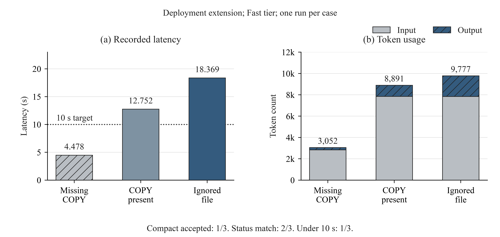
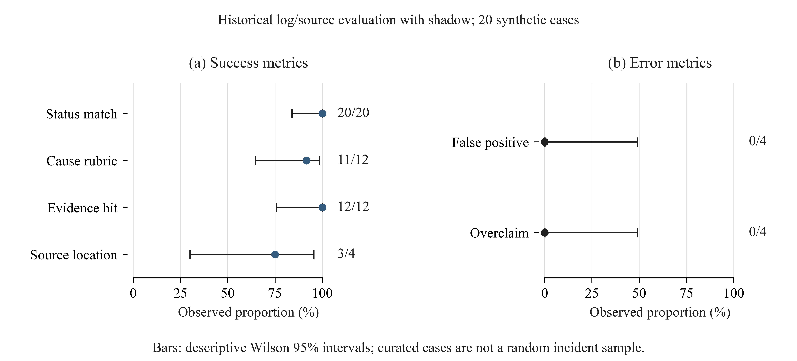
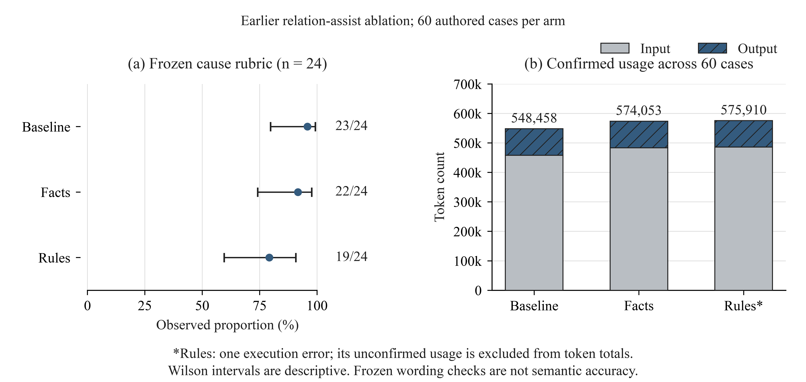
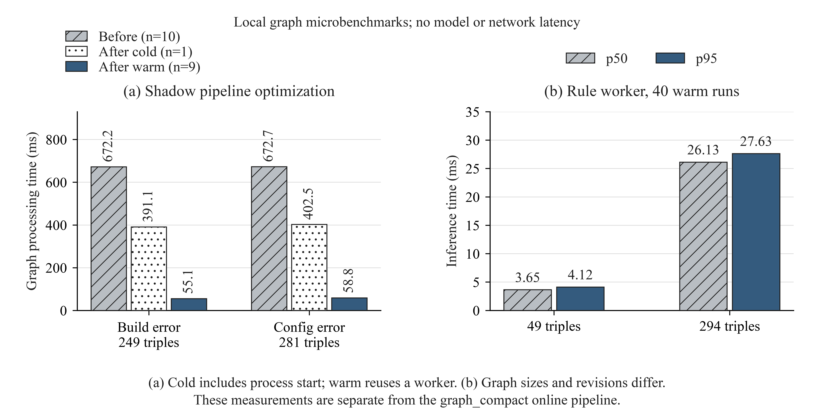

# 정량 평가 결과와 IEEE 스타일 그림

그림 작성: 2026-10-04. 측정 자료: 2026-10-03에 저장한 결과. 이 문서는 기존 측정치를 Python/Matplotlib으로 다시 시각화했으며 새 모델 호출이나 현재 배포 서버 재측정은 수행하지 않았다.

## 읽는 기준

- 시간은 측정 범위를 함께 읽는다. 실제 모델을 호출한 로컬 HTTP 실험은 fixture S3를 사용하며, 운영 로그 수집·실제 S3·프런트 폴링 지연을 포함하지 않는다. 그래프 단독 실험은 LLM·네트워크 시간이 없다.
- 총 토큰은 입력 + 출력이다. 출력에 포함된 reasoning 토큰은 다시 더하지 않는다. 토큰 수와 청구 금액은 다르며 금액은 계산하지 않았다.
- `상태 일치`, `원인 식별 사전 채점`, `SHACL 적합`은 서로 다른 지표다. 원인 채점은 분류·표현 정규식·핵심 인용의 고정 기준이며, 자유 서술의 의미와 실제 해결 성공을 모두 판단하지 않는다.
- 각 사례·모드의 실제 LLM 평가는 1회다. 반복 측정 평균·통계적 유의성·운영 정확도·품질 동등성을 주장하지 않는다. 그래프 작업자 반복 실험의 표본 수는 별도로 표시한다.
- 10월 3일 실측 이후 프롬프트와 템플릿 등이 수정됐다. 따라서 ‘배포 구성 추론’ 수치도 해당 시점 구현의 기록이며 10월 4일 통합본 성능 보증이 아니다.

## 1. 동일 조건: adaptive와 기존 graph_compact

같은 입력·소스 바이트, `gpt-6.1-sol`, reasoning `low`, 출력 상한 4096, Fast 티어로 8개 합성 사례를 각 모드에서 한 번씩 호출했다. 사례별 호출 순서를 교대했으며, 배포 구성 확장 전 graph_compact를 대상으로 한다. S1–S4는 같은 ENOENT 오류군의 지원 변형이고 C1–C4는 복구·다른 앱·소스 불일치·예상 테스트 오류 대조군이다.


**그림 1.** 동일 조건의 사례별 응답 시간과 입력·출력 토큰 합계. 음영은 축약 지원 사례이며 점선은 10초 목표다. 보류 후 재분석하는 C4에서는 호출과 시간이 추가됐다. [벡터 PDF](figures/evaluation/fig01_matched_performance.pdf) · [SVG](figures/evaluation/fig01_matched_performance.svg)

| 범위 | 모드 | n | 응답 중앙값 | 평균 총 토큰 | 10초 이내 | 상태 일치 | 제공자 호출 합계 |
| --- | --- | ---: | ---: | ---: | ---: | ---: | ---: |
| 전체 | adaptive | 8 | 19.922초 | 9,955.12 | 2/8 | 8/8 | 9 |
| 전체 | graph_compact | 8 | 6.017초 | 6,702.50 | 5/8 | 8/8 | 10 |
| 지원 | adaptive | 4 | 20.471초 | 9,146.75 | 0/4 | 4/4 | 4 |
| 지원 | graph_compact | 4 | 3.011초 | 2,181.50 | 4/4 | 4/4 | 4 |
| 대조 | adaptive | 4 | 11.797초 | 10,763.50 | 2/4 | 4/4 | 5 |
| 대조 | graph_compact | 4 | 12.052초 | 11,223.50 | 1/4 | 4/4 | 6 |

지원 4건의 응답 중앙값은 85.3%, 평균 총 토큰은 76.1% 낮았다. 전체 8건의 중앙값은 19.922초 → 6.017초지만, 대조 4건은 11.797초 → 12.052초였다. 지원 사례의 개선을 모든 장애에 적용할 수는 없다.

공개 응답 계약은 양쪽 모두 8/8을 통과했다. 작업 에이전트가 사전 기준에 따라 검토한 핵심 품질도 양쪽 8/8이지만, 독립적인 블라인드 평가가 아니며 세부 해결 절차의 맞춤성이 같다는 의미는 아니다. 같은 개발 사례로 프롬프트를 조정한 이력이 있어 미공개 시험 성적으로 제시하지 않는다. 상세한 초기 보류 실험과 제한은 [기존 평가](GRAPH_COMPACT.md)를 따른다.

## 2. 세 아키텍처의 과거 실행 기록

A1은 초기의 로그 → 조건부 소스 2단계 흐름을 유지한 `standard` 측정, A2는 기존 `graph_compact`, A3는 배포 구성 추론 확장 측정이다. 가장 첫 Git 커밋을 새로 실행한 비교는 아니다. A1은 default 티어, A2·A3는 Fast 티어이며 제공 소스·프롬프트·사례가 다르다. 각 수치는 대표 실행 1회로, 아키텍처만의 개선율을 계산하는 통제 실험이 아니다.


**그림 2.** 조건이 다른 세 시점의 실행 기록. 막대는 단일 관측치이고 오차 막대는 없다. [벡터 PDF](figures/evaluation/fig02_architecture_history.pdf) · [SVG](figures/evaluation/fig02_architecture_history.svg)

| 항목 | A1: 초기 2단계 | A2: 기존 graph_compact | A3: 배포 구성 추론 |
| --- | ---: | ---: | ---: |
| 실행 시간 | 70.591초 | 3.149초 | 4.478초 |
| 입력 토큰 | 14,699 | 1,872 | 2,840 |
| 출력 토큰 | 4,203 | 204 | 212 |
| 총 토큰 | 18,902 | 2,076 | 3,052 |
| 제공자 호출 | 2 | 1 | 1 |
| 조회 소스 파일 | 2 | 1 | 3 |
| SC 근거 줄 | 51 | 10 | 27 |
| 그래프 트리플 | 해당 없음 | 36 | 117 |
| 그래프 처리 시간, 첫 초기화 포함 | 해당 없음 | 123.176ms | 172.706ms |
| 제안 대상 | `/app/data/tasks.json` | `/app/data/tasks.json` | `Dockerfile` |

A3는 Dockerfile·ignore·파일 목록까지 확인해 수정 위치를 제안한다. 소스 줄 수나 그래프 크기가 늘어난 것을 정확도 상승으로 해석하지 않는다. 초기 모드의 그래프 항목 ‘해당 없음’도 0ms 실측과 다르다.

## 3. 배포 구성 추론의 지원 사례와 대조 사례

현재 확장에 해당하는 2026-10-03 저장 결과다. COPY 누락은 compact가 채택됐고, 이미 COPY가 있는 경우와 ignore로 제외된 경우는 일반 분석 경로를 사용했다. 세 사례 모두 제공자 호출은 1회지만 입력·출력 길이와 시간이 다르다.



**그림 3.** 사례별 1회 실측. 공개 응답 계약 3/3, 사전 상태 일치 2/3, 10초 이내 완료 1/3. [벡터 PDF](figures/evaluation/fig03_deployment_cases.pdf) · [SVG](figures/evaluation/fig03_deployment_cases.svg)

| 사례 | 응답 시간 | 총 토큰 | 사전 상태 일치 | 제안 결과 |
| --- | ---: | ---: | --- | --- |
| COPY 누락 | 4.478초 | 3,052 | 일치 | Dockerfile의 단일 파일 COPY 위치 제안 |
| 이미 COPY 있음 | 12.752초 | 8,891 | 불일치 | 중복 COPY를 보류하고 실제 이미지·마운트 확인 요청 |
| ignore 제외 | 18.369초 | 9,777 | 일치 | 제외 규칙과 Dockerfile을 함께 수정하도록 제안 |

‘이미 COPY 있음’은 기대한 `diagnosed` 대신 `insufficient_evidence`를 반환했다. 보수적 보류가 타당하다는 작업 에이전트의 검토와 별개로, 사전 정답은 바꾸지 않고 불일치로 남겼다. Docker 엔진에서의 실제 빌드·수정 성공률은 측정하지 않았다. [배포 해결안 평가](DEPLOYMENT_REMEDIATION.md)

## 4. 초기 로그·소스 진단의 합성 품질 평가

`shadow`는 결과를 그래프로 검증·저장하는 기능이며 이 실험의 LLM 판단을 바꾸지 않는다. 최종 유효 입력 20건은 장애 12건, 정상·복구 4건, 정보 부족 4건이다. 소스 장애 4건은 로컬에서 재현했고 나머지는 작성된 가상 로그다. 그래프 저장과 SHACL 적합은 각각 20/20이며 아래 원인 점수와 구분한다.



**그림 4.** 점은 관측 비율, 가로 막대는 저장된 Wilson 95% 참고 구간, 오른쪽 숫자는 분자/분모다. (a)는 높을수록 좋고 (b)는 낮을수록 좋다. 사례가 운영 장애의 무작위 표본이 아니므로 구간을 운영 성능의 신뢰구간으로 읽지 않는다. [벡터 PDF](figures/evaluation/fig04_synthetic_quality.pdf) · [SVG](figures/evaluation/fig04_synthetic_quality.svg)

| 지표 | 분자/분모 | 관측 비율 |
| --- | ---: | ---: |
| 상태 일치 | 20/20 | 100.0% |
| 원인 식별 사전 채점 | 11/12 | 91.7% |
| 핵심 근거 인용 | 12/12 | 100.0% |
| 지정 코드 위치 연결 | 3/4 | 75.0% |
| 정상·복구 오탐 | 0/4 | 0.0% |
| 정보 부족 단정 | 0/4 | 0.0% |

준비 과정의 임시 경로·아카이브 구성 결함을 고친 뒤 유효 입력의 답변을 집계했다. 원래 정답·채점 기준은 유지했고, 그대로 유효한 나머지 입력의 답변은 재사용했다. 최종 유효 결과의 확인된 호출은 23회·총 172,925토큰이며, 제외된 준비 실행까지 포함하면 31회·총 237,870토큰이다. 이 결과를 새로운 단일 일괄 실행이나 최신 배포 구성 추론의 점수로 표시하지 않는다. [합성 평가 상세](SYNTHETIC_DIAGNOSIS_EVALUATION_2026-10-03.md)

이 답변들을 그대로 재생한 온톨로지 이전/이후 비교는 점수 차이가 0%p였다. 이는 재생 및 shadow의 결과 보존 확인이며 온톨로지 추론의 성능 향상 실험은 아니다. [재생 비교](ONTOLOGY_BEFORE_AFTER_COMPARISON_2026-10-03.md)

## 5. 이전 관계 추론 assist의 60건 비교

`baseline`은 기존 방식, `facts`는 그래프 사실 문맥 추가, `rules`는 사실과 SPARQL 규칙 문맥 추가다. 이 실험의 `rules`는 짧은 LLM 응답과 서버 템플릿을 쓰는 graph_compact와 다르다. 동일한 60개 작성 사례를 각 군에 제공했으며 원인 채점의 분모는 장애 24건이다.



**그림 5.** (a) 고정 원인 채점과 Wilson 참고 구간. (b) 60건 전체의 확인된 입력·출력 사용량. 규칙군의 실행 오류 1건은 점수 분모에 포함하며, 확인되지 않은 토큰은 합계에 들어 있지 않다. [벡터 PDF](figures/evaluation/fig05_relation_ablation.pdf) · [SVG](figures/evaluation/fig05_relation_ablation.svg)

| 지표 | 기존 방식 | 사실 제공 | 규칙 추론 |
| --- | ---: | ---: | ---: |
| 상태 일치 | 60/60 | 60/60 | 59/60 |
| 원인 식별 사전 채점 | 23/24 | 22/24 | 19/24 |
| 핵심 근거 연결 | 24/24 | 24/24 | 23/24 |
| 정상·복구 오탐 | 0/24 | 0/24 | 0/24 |
| 정보 부족 단정 | 0/12 | 0/12 | 0/12 |
| 실행 오류 | 0 | 0 | 1 |
| 모델 요청 제출 | 72 | 72 | 72 |
| 확인된 제공자 호출 | 72 | 72 | 71 |
| 확인된 입력 토큰 | 457,986 | 483,687 | 486,099 |
| 확인된 출력 토큰 | 90,472 | 90,366 | 89,811 |
| 응답 중앙값 | 16.939초 | 16.808초 | 16.836초 |
| 이 표본의 p95, nearest-rank | 57.093초 | 56.619초 | 56.645초 |

규칙군은 원인 사전 채점 19/24로 기존 23/24보다 낮았다. 미통과 5건은 실행 오류 1건과 원인 표현 정규식 미통과 4건이다. 동등한 표현도 탈락할 수 있어 이를 그대로 의미 정확도 하락으로 해석하지 않지만, 개선을 입증한 결과도 아니다. 사후에 채점 표현을 바꾸어 점수를 올리지 않았다. 독립적인 블라인드 의미 평가는 아직 없다.

별도의 규칙 단독 평가에서는 60개 합성 사례의 지정 관계 72개가 일치해 TP=72, FP=0, FN=0이었다. 이는 지원 문법의 관계 생성 검증이며 위 LLM 원인 점수와 구분한다. [관계 추론 평가 상세](RELATION_REASONING_TEST_REPORT_2026-10-03.md)

## 6. 그래프 처리 비용



**그림 6.** (a) 같은 저장 진단의 shadow 처리 시간. 개선 전은 사례별 10회 중앙값, 개선 후는 첫 실행 1회와 작업자를 재사용한 9회 중앙값이다. (b) 관계 추론 작업자의 예열 후 40회 p50·p95. 두 그래프 크기의 측정 사이에 규칙 방어 조건 보완이 있어 크기만의 확장성 실험이 아니다. 이 그림은 graph_compact 앞단의 시간을 측정한 그림 2와 별도 실험이다. [벡터 PDF](figures/evaluation/fig06_graph_overhead.pdf) · [SVG](figures/evaluation/fig06_graph_overhead.svg)

| shadow 처리 대상 | 개선 전 중앙값, n=10 | 개선 후 첫 실행, n=1 | 개선 후 재사용 중앙값, n=9 |
| --- | ---: | ---: | ---: |
| 빌드 타입 오류, 249트리플 | 672.234ms | 391.101ms | 55.061ms |
| 런타임 설정 오류, 281트리플 | 672.703ms | 402.519ms | 58.848ms |

별도 로컬 HTTP 재생 10회씩의 중앙값은 off 15.266ms, shadow 18.508ms로 차이는 3.242ms였다. LLM 응답을 재생한 측정이므로 실제 모델 호출 지연과 합산하거나 운영 추가 지연으로 일반화하지 않는다.

관계 추론의 294트리플 측정은 예열 215.094ms, worker 최대 RSS 약 48.9MiB였다. CPU 1.801초는 예열과 성공한 64개 작업을 포함한 프로세스 전체 값이며 요청당 CPU가 아니다. 동시성 2의 16요청 중 8건, 동시성 4의 32요청 중 24건은 `busy`로 빠르게 복귀했다. 이 시간을 성공한 추론 시간에 섞지 않았다. [그래프 성능](KNOWLEDGE_GRAPH_PERFORMANCE_2026-10-03.md) · [추론 성능](RELATION_REASONING_TEST_REPORT_2026-10-03.md)

## 그림 형식과 재생성

[IEEE Author Center의 크기·해상도 안내](https://journals.ieeeauthorcenter.ieee.org/create-your-ieee-journal-article/create-graphics-for-your-article/resolution-and-size/)와 [글꼴·그래픽 안내](https://conferences.ieeeauthorcenter.ieee.org/write-your-paper/improve-your-graphics/)를 참고했다. 모든 그림은 2단 폭 7.16인치, Times 계열 9–10pt, 흰 배경, 얇은 축, (a)/(b) 패널로 구성했다. 색 외에도 패턴·레이블을 사용한다. PNG는 900dpi, PDF는 글꼴을 포함한 벡터, SVG는 글자를 경로로 저장한다. 특정 학회의 최종 제출 검수를 받은 파일이라는 의미는 아니다.

README는 PNG를 사용하고 논문·인쇄에는 PDF를 사용할 수 있다. 그림에는 영문 축을 쓰고 실험 조건·해석은 위 한국어 캡션으로 설명한다. 고정 폭을 유지하도록 저장 시 자동 tight crop을 사용하지 않았다.

저장소 루트에서 별도 그림용 가상환경으로 실행한다. 모델·API 키·원본 `results/`가 없어도 포함된 수치 스냅샷으로 재생성된다.

```sh
python3 -m venv .runtime/figures-venv
.runtime/figures-venv/bin/pip install -r evaluation/requirements-figures.txt
.runtime/figures-venv/bin/python evaluation/plot_ieee_metrics.py
```

- [Python 생성 코드](../evaluation/plot_ieee_metrics.py): 집계 재계산·토큰 합계 확인 후 6개 그림을 PNG/PDF/SVG로 출력한다.
- [측정치 스냅샷](../evaluation/paper_metrics.json): 사례별 시간·토큰·상태, 품질 분자/분모, 미리 계산된 참고 구간, 원본 파일 경로·SHA-256을 포함한다. 원문 프롬프트·로그·API 키는 포함하지 않는다.
- [동일 조건 집계 CSV](figures/evaluation/paired_summary.csv) · [사례별 CSV](figures/evaluation/case_metrics.csv)
- [렌더링 기록](figures/evaluation/render_manifest.json): 데이터 해시, 라이브러리 버전, 글꼴, 출력 파일 해시를 기록한다.

원본 실행 파일은 기존 Git 제외 경로인 `results/`에 유지한다. 그림을 재생성하는 것과 원래 LLM 실험을 재실행하는 것은 다르다. 라이브러리·글꼴이 달라지면 파일 해시나 렌더링은 달라질 수 있다.
