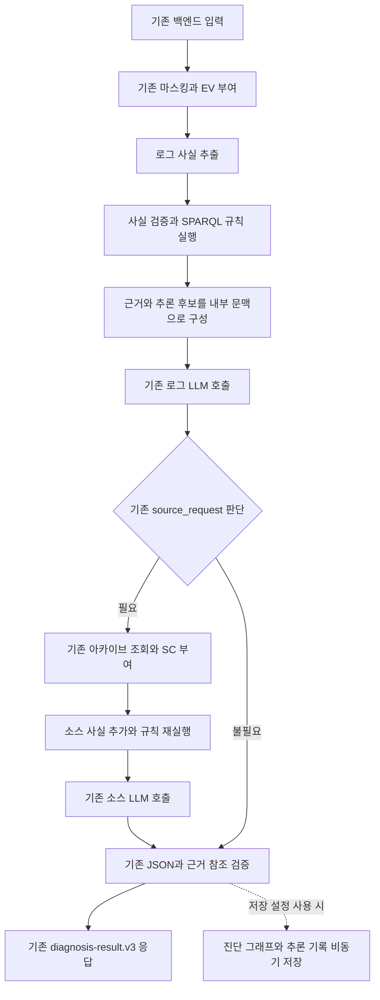

# 장애 진단 Agent 관계 추론 개발 계획

작성일: 2026-10-03

상태: 초기 구현 완료. 실제 구현 범위와 한계는 [개발 문서](RELATION_REASONING.md), 검증 결과는 [검증 보고서](RELATION_REASONING_TEST_REPORT_2026-10-03.md)를 참고한다.

현재 진단 뒤에 저장하는 지식 그래프를 확장하여, **LLM이 판단하기 전에 로그와 코드의 관계를 계산하고 근거와 함께 전달하는 기능**을 개발한다. 백엔드 요청과 공개 응답 규격은 유지한다. 로그 분석 1회, 필요한 경우 소스 분석 1회의 기존 LLM 호출 흐름 안에서 동작하도록 한다.

첫 구현은 RDFLib와 개발자가 작성한 SPARQL 규칙을 사용한다. SHACL은 데이터와 추론 기록의 구조를 검사하고, LLM은 규칙이 제시한 후보와 원문 근거를 검토하여 기존 형식의 진단을 작성한다. 규칙에 맞았다는 이유만으로 실제 장애 원인을 확정하지 않는다.

## 현재 구현과 변경 목표

| 항목 | 현재 구현 | 이번 개발 목표 |
|---|---|---|
| 그래프 생성 시점 | 최종 진단 뒤 비동기 관찰 | 로그 분석 전, 필요시 소스 분석 전에도 생성 |
| 그래프 내용 | EV·SC 근거와 LLM이 주장한 관계 | 원문에서 추출한 사실과 규칙으로 도출한 관계 추가 |
| 관계 추론 | 없음 | 범위·시간·대상을 확인하는 고정 SPARQL 규칙 |
| LLM에 전달하는 자료 | 로그, 소스와 기존 문맥 | 기존 자료에 작은 내부 추론 문맥 추가 |
| SHACL 역할 | 진단 그래프의 구조 검사 | 사실 그래프와 추론 출처까지 구조 검사 |
| 외부 요청과 응답 | 백엔드 envelope, diagnosis-result.v3 | 필드·자료형·필수 여부·오류 계약 유지 |
| 모델 호출 | 로그 1회, 조건부 소스 1회 | 같은 상한 유지, 추출·채점·재검토용 호출 추가 없음 |

현재 `source_analysis.py`의 `diagnose_with_source()`는 두 진단 단계를 마친 뒤 `graph_observer.submit()`을 호출한다. `knowledge/validation.py`는 `inference="none"`, `advanced=False`로 동작한다. 기존 `supports`·`opposes` 관계는 모델의 주장을 보관하며 인과관계의 증명이 아니다.

기존 20건 비교에서는 같은 모델 답변을 재생했을 때 입력·출력과 정확도 지표가 같았다. 이번 기능의 효과는 새로운 모델 호출을 사용하는 비교 평가로 검증해야 한다. [기존 구조 비교 보고서](/Users/gimhwan/Desktop/iris-error-check-agent/docs/ONTOLOGY_BEFORE_AFTER_COMPARISON_2026-10-03.md)

## 적용할 진단 흐름



로그 단계는 `prepare_backend()` 또는 `prepare()`가 반환한 마스킹된 `bundle`을 사용한다. 소스 단계는 기존 `select_source()`가 선택하여 실제로 LLM에 전달하는 SC 범위만 사용한다. 그래프가 새로운 외부 자료를 수집하거나 추가 LLM 호출을 유발하지 않는다. 그래프 후보가 첫 번째 LLM의 기존 `source_request` 선택에 영향을 주는 것은 허용한다.

추론 단계가 실패하거나 제한 시간을 넘기면 해당 단계의 기존 입력과 프롬프트로 진행한다. 소스 추론만 실패한 경우 로그 단계에서 이미 사용한 추론 문맥까지 되돌리지는 않으며, 단계별 적용 여부를 내부 기록에 남긴다.

## 사실과 추론과 모델 주장의 구분

한 진단에서 세 종류의 그래프를 논리적으로 분리한다. 기존 진단 그래프의 의미를 바꾸지 않고 `urn:iris:reasoning:v1:` 네임스페이스를 추가한다.

| 구분 | 저장할 내용 | 판단에서의 취급 |
|---|---|---|
| 사실 그래프 | 원문에 기록된 포트·설정 키·오류·복구 이벤트, EV·SC 위치 | 출처가 있는 관찰 또는 코드상의 선언 |
| 추론 그래프 | 규칙 ID·버전, 입력 사실, 도출 관계, 전제와 미확인 정보 | 조건에 의존하는 파생 관계와 원인 후보 |
| 진단 그래프 | LLM의 관찰·가설·반대 근거·다음 확인 | 기존 모델 주장, 추론의 사실 입력으로 재사용하지 않음 |

사실 그래프의 핵심 노드는 `ProcessInstance`, `ListenerObservation`, `ProbeObservation`, `ConfigReference`, `FailureEvent`, `RecoveryEvent`로 제한한다. 모든 노드는 해당 진단과 배포 시도에 속하며 원문 근거까지 역추적할 수 있어야 한다. 원문에서 추출했다는 사실도 로그 자체의 진실성이나 실제 실행을 보증하지 않으므로, 코드의 설정 선언과 실행 로그의 관찰을 구분한다.

각 추출 사실에는 종류, 정규화한 값, EV·SC ID, 원문 위치, 추출기 버전, 대상 식별 근거, 시간·순서와 그 신뢰 범위를 기록한다. 각 추론에는 규칙 버전, 입력 사실 ID, 결론 종류, 근거 ID, 전제 충족 상태, 반대 근거와 미확인 정보를 기록한다.

### 관계를 연결하는 범위

- 진단별 격리와 `tenant/project/service/deployment/attempt` 범위를 우선한다. 현재 입력에 없는 식별자는 새로 추측하지 않는다.
- `sourceId`가 같다는 이유만으로 같은 프로세스라고 간주하지 않는다. 명시적 프로세스·컨테이너 식별 정보가 있을 때 연결하고, 없으면 해당 연결을 요구하는 규칙은 보류한다.
- `sequence`는 동일한 source·stage·stream 안에서만 순서 근거로 사용한다. 다른 출처의 숫자를 직접 비교하지 않는다.
- 시각이 가까운 두 이벤트가 같은 작업이거나 원인·결과라는 결론은 내리지 않는다. 재시작 경계, 대상, 실행 세대가 확인되어야 한다.
- `logRange.isComplete=true`는 조회 범위의 로그 완전성이다. 모든 리스너·환경변수·프록시 설정을 관찰했다는 의미로 확장하지 않는다.
- 소스 커밋은 기존 `caller_supplied` 한계를 유지한다. 코드의 기본 포트를 실제 실행 포트로 단정하지 않는다.

**현재 입력만으로 전제를 충족하지 못하는 사례는 반드시 남는다.** 외부 계약을 유지하는 조건에서는 규칙 적용 가능 비율도 결과 지표로 공개해야 한다. 정보가 없을 때 관계를 만들어 정확도를 높인 것처럼 평가하지 않는다.

## 첫 구현의 사실 추출 범위

LLM 추가 호출 없이 고정 파서로 명시적 표현을 추출한다. 우선 지원할 로그 형식과 실패·반례 예제를 함께 버전 관리한다.

| 자료 | 추출 예 | 제한 |
|---|---|---|
| 실행 로그 | listening 주소·포트, probe 대상·결과, 명시적 오류 코드 | 같은 문장에 포트가 있다는 이유만으로 역할을 지정하지 않음 |
| 작업 로그 | 작업 ID, 실패·재시도·성공, 프로세스 시작·종료 | 작업과 실행 세대를 연결할 정보가 없으면 연결 보류 |
| 설정 오류 | 누락됐다고 명시된 키, 형식 오류, 실제 참조 키 | 비밀값을 복원하거나 전달하지 않음 |
| 선택된 소스 | Python AST의 직접적인 환경변수 조회·상수·설정 접근 | 실행하지 않으며 동적 키·불완전 코드 조각은 미지원으로 기록 |

첫 소스 파서는 Python의 직접 참조부터 지원한다. 다른 언어나 프레임워크의 지원은 별도 파서와 반례 검증 후 확장한다. 지원하지 않는 코드는 기존 LLM 분석을 계속 사용한다. 문자열 유사도만으로 설정 키 오타나 같은 엔터티를 확정하지 않는다.

## 우선 구현할 규칙

첫 릴리스는 다음 세 규칙군에 집중한다. 규칙군별로 관찰 관계와 원인 후보를 구분하며, 입력에서 충족한 전제만 결과에 표시한다.

| 규칙군 | 필요한 증거와 전제 | 도출할 결과 | 반드시 포함할 반례 |
|---|---|---|---|
| 포트와 검사 대상 | 연결 가능한 동일 실행의 리스닝 포트, probe 대상·결과 | 관찰된 포트 차이. 직접 연결·해당 시점의 대상 리스너가 확인될 때 포트 불일치 원인 후보 | 정상 포트 매핑, 프록시 경유, 다중 리스너, 이전 실행 로그, 연결 경로 미상 |
| 실패 후 복구 | 같은 작업·대상·실행의 실패와 뒤이은 명시적 성공 | 해당 실패가 이후 복구됐다는 관계. 그 실패를 현재 장애 원인으로 제시하는 데 대한 반대 근거 | 다른 작업 성공, 이전 배포 성공, 복구 뒤 재실패, 성공 시각 미상 |
| 설정 계약과 코드 참조 | 명시적 설정 계약의 키, 실제 선택된 코드의 참조 키, 일치하는 실행 오류 | 서로 다른 키의 참조 관계와 설정 불일치 원인 후보 | 정상 별칭, 기본값, 런타임 키 변환, 주석만의 주장, 실행 커밋 미확인 |

포트 3000과 8080이 다르다는 관찰만으로 `causedBy`를 생성하지 않는다. 직접 연결 여부나 매핑이 불명확하면 `observed_port_difference`와 미확인 항목만 전달한다. 현재 활성 리스너 전체를 확인할 수 없다면 다른 포트의 리스너가 없다고 가정하지 않는다.

복구 규칙 역시 한 실패의 복구를 전체 서비스 정상으로 확대하지 않는다. 설정 규칙의 명시적 계약이 없으면 철자가 비슷한 두 키는 원인 후보의 확정 조건을 충족하지 않는다.

릴리스 실패와 후속 기동 실패의 연결, 루프백 바인딩과 외부 접근 실패, 의존 서비스 오류 전파는 후속 규칙군으로 둔다. 특히 의존 서비스의 토폴로지가 현재 자료에 없으면 전파 경로를 추정하여 채우지 않는다.

## SPARQL 실행과 SHACL 검증

SPARQL의 `WHERE`로 조건에 맞는 사실을 찾고 `CONSTRUCT`로 파생 그래프를 만든다. 규칙 실행 순서와 반복 종료는 Python 실행기가 관리한다. 이때 원인 후보의 의미와 전제는 개발자가 정의하는 도메인 규칙이다. [W3C SPARQL CONSTRUCT 정의](https://www.w3.org/TR/sparql11-query/#construct)

첫 실행기는 아래 두 층으로 제한한다.

1. 원문 사실 → 포트 차이, 같은 작업의 선후 관계, 설정 참조 차이.
2. 검증된 관계와 명시적 오류 → 원인 후보 또는 기존 후보에 대한 반대 근거.

최대 2라운드만 실행하고 각 라운드에서 입력 그래프를 고정한다. 규칙 버전과 정규화한 바인딩으로 안정적인 ID를 생성하여 중복 노드와 반복 증식을 막는다. 첫 버전은 도출한 사실을 다시 철회하는 일반 비단조 추론을 구현하지 않으며, 로그·소스 단계별 스냅샷에서 다시 계산한다. 로그에 없다는 이유로 부재를 도출하는 규칙은 넣지 않는다.

규칙은 저장소에 있는 고정 쿼리만 실행한다. LLM이 SPARQL을 작성하거나 실행하지 않는다. 입력 문자열은 RDF 값으로 바인딩하며 쿼리 문자열에 삽입하지 않는다. 외부 `SERVICE`·원격 그래프 로딩·임의 스크립트는 허용하지 않는다.

SHACL은 규칙 실행 전후에 자료형·근거 참조·범위·필수 출처를 검사한다. 예를 들어 포트 범위, EV·SC 존재 여부, 입력 사실과 결론의 배포 시도 일치, 규칙 버전 누락을 검사한다. SHACL 적합 여부로 진단의 사실성을 판정하지 않는다. [W3C SHACL 정의](https://www.w3.org/TR/shacl/)

기존 SHACL 진단 검증은 유지하고 추론용 shapes를 별도로 추가한다. 첫 버전에서 SHACL Advanced Features의 규칙 실행이나 OWL 전체 추론으로 이전하지 않는다. 입력·출력 검증과 규칙 실행을 분리하여 어떤 규칙 때문에 결론이 나왔는지 추적한다.

## LLM에 전달할 내부 문맥

LLM 입력에만 `reasoning_context`를 추가한다. 다음은 형식 제안이며 공개 API 응답 필드가 아니다.

```json
{
  "schema_version": "reasoning-context.v1",
  "candidates": [{
    "kind": "observed_port_difference",
    "rule_id": "PORT_DIFFERENCE_V1",
    "evidence_ids": ["EV000002", "EV000005"],
    "source_evidence_ids": [],
    "claim": "연결된 리스너 관찰 포트와 probe 대상 포트가 다르다.",
    "status": "derived_relation",
    "counter_evidence_ids": [],
    "missing_information": ["직접 연결 여부", "포트 매핑", "다른 활성 리스너"]
  }]
}
```

원인 후보는 별도 `status="candidate"`로 표시한다. 점수를 임의의 확률처럼 제공하지 않는다. 단순히 규칙 우선순위가 높다는 이유로 확신도를 높이지 않으며 경쟁 후보와 반대 근거를 함께 보여준다.

LLM 프롬프트에는 후보의 전제와 원문을 검토하고, 필요하면 후보를 채택하지 않으며, 확인되지 않은 사항은 기존 가설·다음 확인 필드에 표현하도록 추가한다. 공개 결과는 계속 실제 EV·SC ID를 인용한다. 내부 규칙 ID를 공개 근거 ID로 대체하지 않는다.

서버는 기존 JSON·참조 검증에 더해 내부 문맥의 출처를 검증한다. 첫 버전에서 규칙과 다른 LLM 결론을 강제로 덮어쓰거나, 의미 검증을 위한 세 번째 LLM 호출을 하지 않는다. LLM이 후보를 활용했는지는 평가 시 의미 검토로 확인한다.

문맥은 상위 3개 후보, UTF-8 4KiB 이내를 초기 상한으로 제안한다. 기존 로그·소스 근거와 총 프롬프트 한도를 우선한다. 근거·반례·미확인 사항을 온전히 넣을 수 없는 후보는 통째로 제외하며, 공간이 없으면 추론 문맥을 생략한다. 새로운 문맥을 넣기 위해 기존 원문 근거를 조용히 삭제하지 않는다. 프로필별 실제 한도를 사용하며 기본 32KiB를 모든 환경의 고정값으로 가정하지 않는다.

## 설정과 실패 처리

기존 `AGENT_KG_MODE=off|shadow`는 저장·관찰 설정으로 유지한다. 새 내부 설정 `AGENT_REASONING_MODE=off|assist`를 추가하고 기본값은 `off`로 한다.

| 설정 조합 | 동작 |
|---|---|
| reasoning off, KG off | 기존 기본 진단 |
| reasoning off, KG shadow | 현재 구현된 그래프 관찰 |
| reasoning assist, KG off | 요청 단위 메모리 추론과 LLM 문맥 제공, 전체 그래프 파일 저장 없음 |
| reasoning assist, KG shadow | 추론 문맥 제공과 추론·진단 기록 저장 |

규칙이 하나도 맞지 않은 경우는 정상적인 `no_match`로 처리한다. 시간 초과, 슬롯 부족, 한도 초과, 구조 검증 실패, 프로세스 오류는 별도 상태로 기록하고 원래 진단 경로를 사용한다. 이 상태를 새 공개 오류 코드나 응답 필드로 노출하지 않는다.

기본값 `off`에서 기존 프롬프트·모델 입력·응답 스키마가 동일한지 회귀 검증한다. `assist`는 진단 내용의 개선을 목적으로 하므로 답변 문장과 후보 순위는 달라질 수 있지만, 공개 계약과 호출 상한은 유지한다.

## 지연시간과 자원 한도

현재 재사용 shadow 프로세스의 전체 처리 중앙값은 두 소규모 사례에서 약 55–59ms였고, 첫 실행은 약 391–403ms였다. HTTP 추가 지연 약 3.24ms는 응답이 그래프 완료를 기다리지 않았던 측정이다. **추론은 LLM 호출 전에 결과를 기다리므로 기존 3.24ms를 그대로 기대할 수 없다.** [기존 성능 보고서](/Users/gimhwan/Desktop/iris-error-check-agent/docs/KNOWLEDGE_GRAPH_PERFORMANCE_2026-10-03.md)

다음은 측정 결과가 아닌 초기 구현 한도와 목표다.

| 항목 | 제안 |
|---|---|
| 실행 위치 | 별도의 재사용 추론 프로세스, API 이벤트 루프 밖 |
| 프로세스 수 | API 프로세스당 추론 1개부터 시작 |
| 대기열 | 없음. 슬롯이 차면 해당 단계는 기존 진단으로 진행 |
| 작업 제한 시간 | 단계당 200ms 후 포기, 로그·소스 합계 최대 400ms의 계산 대기 예산 |
| 성능 목표 | 준비된 프로세스, 사실 그래프 300트리플 내외에서 단계 p95 150ms 이하 |
| 입력과 그래프 한도 | 직렬화 입력 256KiB, 사실 2,000트리플, 새 추론 노드 100개, 총 5,000트리플 이하 |
| 규칙 실행 | 최대 2라운드, 고정 쿼리 실행 계획 캐시 |
| LLM 비용 | 추가 호출 0회. 문맥 증가와 소스 선택 변화에 따른 토큰·호출 분포는 별도 측정 |

추론 프로세스는 시작 시 예열하며 준비되기 전 요청은 기존 진단으로 처리한다. 프로세스 시작·교체가 첫 사용자 요청의 동기 대기가 되지 않도록 한다. 시간 초과 시 슬롯을 격리하고 프로세스 종료·재생성은 별도로 수행하여 무한 대기나 다음 작업과의 응답 혼선을 막는다. 400ms는 추론 계산 대기 예산이며 직렬화·이벤트 루프 스케줄링까지 포함한 HTTP 지연 보장은 아니다.

기존 shadow worker는 최종 진단 기록을 입력으로 받으므로 그대로 호출하여 사전 추론을 수행할 수 없다. 첫 구현은 전용 추론 worker를 두고 기존 프로세스 관리 방식을 참고한다. 저장 worker와의 슬롯 경쟁을 피하는 대신 두 기능을 켜면 프로세스 메모리가 함께 필요하다. 기존 worker 약 56MiB는 참고값이며 신규 추론 프로세스의 메모리 상한으로 사용하지 않는다. 동시 요청 1·2·4개에서 RSS, CPU, p95, 슬롯 부족률을 측정한 후 개수를 조정한다.

시간 초과·검증 실패 시 일부 계산 결과를 LLM에 전달하지 않는다. 기존 LLM 단계별 제한 시간은 유지하며 추론 시간은 내부 단계별 지표와 공개 전체 `execution.elapsed_ms`에 반영한다. 기존 LLM 단계 시간의 의미를 바꾸지 않는다.

## 기록과 재현성

요청 간의 전역 그래프 DB는 첫 구현에서 도입하지 않는다. 진단별 사실·추론을 메모리에서 계산하고 `KG shadow`일 때 기존 진단 디렉터리에 다음 내부 산출물을 추가한다.

- `reasoning-facts.json.gz`: 단계별 사실과 원문 위치.
- `reasoning-trace.json.gz`: 규칙 발동·보류·반대 근거·사용한 후보와 문맥.
- `reasoning-metrics.json`: 추출·검증·규칙·문맥 구성 시간, 한도, 적용 여부와 실패 이유.

추출기·온톨로지·shapes·규칙·프롬프트의 버전 및 해시, 마스킹 입력 해시를 저장한다. 재현에 쓰인 자원도 해당 버전으로 보관한다. 기존 마스킹·권한·산출물 크기 제한을 공유하며 추가 파일 때문에 총 저장 예산을 우회하지 않는다. 저장 실패는 진단을 바꾸지 않지만 내부 상태에 남긴다. 기존 비동기 저장과 동일하게 강제 종료 시 미완료 기록의 영속성은 보장하지 않는다.

## 개발 순서와 변경 파일

표의 Python 모듈은 저장소의 `src/ai_error_check_agent/` 아래를 기준으로 한다. `evaluation/`, `tests/`, `.env.example`은 저장소 루트 기준이며 신규 경로는 제안이다.

| 순서 | 작업과 파일 | 완료 조건 |
|---|---|---|
| 1 | 규칙 명세와 개발 사례 작성. `evaluation/relation_reasoning.dev.v1.json` | 규칙마다 필요한 정보, 맞는 사례, 반례, 보류 사유가 있음. 현 입력에서 확보 가능한 전제 확인 |
| 2 | `knowledge/facts.py`, `reasoning_ontology.ttl`, `reasoning_shapes.ttl` | EV·SC에서 사실 추출, 대상·시간 범위 보존. 지원하지 않는 표현은 억지로 파싱하지 않음 |
| 3 | `knowledge/rules/*.rq`, `reasoner.py` | 세 규칙군 실행, 안정적 ID·2라운드·한도·출처 검증, 반례와 교차 시도 혼입 검사 통과 |
| 4 | `knowledge/context.py`, `reasoning.py`, `reasoning_worker.py` | 제한된 문맥, 예열·시간 초과·슬롯 부족·취소·프로세스 재생성 처리 |
| 5 | `source_analysis.py`, `api.py`, `.env.example` | 두 LLM 호출 직전 연결, 기본 off 동일성, v3 계약과 EV·SC 검증, 종료 처리 유지 |
| 6 | `evaluation/run_relation_ablation.py`, `tests/test_reasoning.py`, API·소스 회귀 검사 | 실제 LLM 비교, 자원 측정, 실패 사례 보고, 도입 기준 판단 |

최초로 확인할 수 있는 기능은 **포트 차이 사실 추출 → 한 규칙 실행 → 내부 문맥 → 기존 로그 LLM → v3 응답**의 전체 흐름으로 만든다. 이 흐름에서 off 동일성과 실패 시 복귀를 먼저 검증한 뒤 복구 규칙과 소스 설정 규칙을 추가한다. 처음부터 모든 장애 유형을 포괄하는 온톨로지를 설계하지 않는다.

## 정확도 비교 설계

기존 20건은 일반 진단 회귀용으로 유지한다. 별도로 개발용 24건과 고정 평가용 60건을 제안한다. 고정 평가 60건은 관계 기반 장애 24건, 오해하기 쉬운 반례 12건, 정상·복구 12건, 정보 부족 12건으로 구성한다. 규칙의 성공 예만 넣지 않고 순서 혼동·다중 원인·매핑·누락을 섞는다.

개발과 평가는 서비스명이나 포트 번호만 바꾼 복제본으로 나누지 않는다. 로그 템플릿·애플리케이션·코드 표현을 분리하고, 개발용 결과로 규칙을 확정한 뒤 평가용 정답을 동결한다. 가능한 사례는 통제된 장애 주입과 수정 후 복구로 원인을 확인하고, 작성한 가상 로그와 별도로 표시한다. 평가 정답·사례 이름·정답 설명은 모델과 규칙 입력에 전달하지 않는다.

| 비교군 | LLM에 주는 문맥 | 확인할 효과 |
|---|---|---|
| A 기존 방식 | 기존 원문 근거와 기존 프롬프트 | 현재 기준 성능 |
| B 그래프 사실 제공 | 같은 원문 + 추출된 사실·출처, 추론 후보 없음 | 사실 구조화 효과 |
| C 그래프 규칙 추론 | 같은 원문 + 사실과 규칙 결과·반대 근거 | B 대비 관계 추론의 추가 효과 |

B와 C의 공통 안내문·사실 목록·사실 선택 순서를 고정한다. C에만 규칙 결과를 추가하고, 공간이 부족하면 공통 사실을 지우지 않고 후보를 생략한다. 모델·모델 설정·원문·최대 문맥 한도를 맞추며 실제 토큰 차이는 기록한다. A와 C는 전체 기능 효과, B와 C는 추가 추론 문맥의 효과로 해석한다. 토큰 길이 차이까지 완전히 통제한 인과 실험으로 주장하지 않는다.

동일한 백엔드 입력과 소스 아카이브를 제공하되, 첫 단계 판단에 따라 실제로 선택된 소스 범위는 달라질 수 있다. 이 차이는 전체 진단 흐름의 효과로 기록한다. 소스 단계의 추론 효과만 분리할 필요가 있으면 같은 SC 범위를 고정한 보조 평가를 사용한다.

각 비교군은 모델을 독립적으로 호출한다. 같은 답변의 재생은 계약 검사에만 사용한다. 60건 × 3개 비교군의 1회 평가는 기존 단계 상한 기준 **180–360회** 모델 호출 범위이며 실제 소스 선택에 따라 달라진다. 먼저 개발용으로 연결을 검증하고 본 평가 호출 수와 토큰을 산정한다. 이 계획 작성 단계에서는 모델을 호출하지 않는다.

호출 전 입력·아카이브·정답 파일의 유효성을 검사하고, 비교군 실행 순서는 사례별로 균형 있게 섞는다. 실행 실패와 미완료 수를 분리하여 공개하고 유리한 답변만 골라 재실행하지 않는다. 1회 평가에는 모델 출력 변동성이 남으므로 결과가 경계에 있으면 전체 비교군을 같은 횟수로 추가 반복하고 그 비용을 별도로 산정한다.

### 측정할 지표

| 계층 | 지표와 분모 |
|---|---|
| 추출 | 지원 사실 종류별 precision·recall·F1, 잘못 연결한 대상·배포 시도 수 |
| 추론 | 검토한 전체 정답 관계 대비 precision·recall·F1, 반례에서의 잘못된 후보 수 |
| 적용 범위 | 전체 사례 중 전제 충족·규칙 발동·보류 비율, 보류 사유 분포 |
| 진단 | 장애 사례의 최상위 원인 식별률, 핵심 근거 연결률, 사례별 정오 변화 |
| 보류 판단 | 정상·복구 오탐률, 정보 부족 사례의 원인 단정률 |
| 실행 | 계약 위반, 잘못된 EV·SC, 호출 상한 위반, 실행 실패와 fallback 비율 |
| 비용과 시간 | LLM 호출·토큰, 추론 단계와 전체 HTTP p50·p95, CPU·RSS |

관계 정답은 모델 출력이나 생성 그래프에서 복사하지 않고 원래 사례의 사실·조건에서 작성한다. 정답 관계가 일부만 있는 자료로 전체 관계 precision을 계산하지 않는다. 정답 관계가 없는 정상 사례는 F1을 임의로 100%로 채우지 않고 잘못 도출한 관계 수를 보고한다.

원인 문장의 의미는 사전 기준과 비교군을 가린 사람 검토를 병행한다. 기존 정규식 채점만으로 의미 정확도를 결론내리지 않는다. 코드 위치 평가는 사전에 코드 확인이 필요한 것으로 지정한 사례를 별도로 보고하며, 로그만으로 충분한 진단이 소스를 생략한 것을 곧바로 오진으로 세지 않는다.

정확도에는 분모와 95% 참고 구간을 붙이고 A→C, B→C의 정오 변화표를 제시한다. 작은 합성 집합의 향상을 운영 장애 정확도로 일반화하지 않는다. 추후 담당자가 원인·수정·복구를 확인한 실제 장애에서도 같은 절차로 검증한다.

## 도입 판단 기준

다음 수치는 성과 예측이 아니라 구현과 평가 전에 정할 초기 목표다.

- 외부 스키마·근거 참조·호출 상한 검사 통과. 추론 off에서 기존 입력·프롬프트 동일성 유지.
- 대상 혼동, 정상 포트 매핑, 다른 작업의 복구 등 필수 반례에서 잘못된 원인 확정 0건.
- 고정 평가의 관계 기반 장애에서 C의 원인 식별률이 A보다 10%p 이상 개선되는 것을 목표로 삼고, C가 B보다 나아지는지도 별도로 확인.
- 정상·복구 오탐과 정보 부족 단정의 관측 건수가 A보다 늘어나면 원인을 조사하고 기본 적용 보류. 작은 표본의 0건은 안전성 보장이 아님.
- 단일 요청·예열 상태에서 추론 단계 p95 150ms 목표를 확인하고, 동시 부하에서는 지연과 fallback 비율을 함께 공개. fallback 덕분에 빠른 결과를 추론 성공 성능으로 집계하지 않음.

차이가 없으면 원인 추론이 충분했는지, 사실 구조화만으로 같은 효과가 나는지, 입력 정보 부족으로 대부분 보류됐는지 구분한다. 개선 근거가 없으면 기본 모드는 off로 유지하고 규칙·데이터 범위를 조정한다. 모든 규칙의 자동 강제 적용, 코드 자동 수정, 전역 그래프 DB는 이 개발 범위에 포함하지 않는다.
